# 13 ModelCopilot 平台实测走查（2026-05-05 快照）

## 本章简介

本章是 [12-modelcopilot-deep](12-modelcopilot-deep.md) 的**实测验证补章**。docs/12 整理了 WSE-Lab 的论文、仓库、自报指标；本章给出**直接登录 `http://116.204.36.247` 的端到端走查证据**：

- 登录 / 注册 / 找回密码三套表单（注册对外开放 → §3.1）
- 完整菜单图谱：File 菜单 5 项 + Run 菜单 3 项 + Settings 面板 5 项控件（§3.2 / §3.5）
- 实时「左编辑器 + 右图」并排工作流的实拍图（§3.9）
- 7 种视图（All / Action / General / Requirement / State / Structure / Usecase）的真实 PlantUML SVG（§4）
- API 表面：6 个端点 + 完整请求 / 响应契约（§5）
- **OMG Pilot Implementation 同源性取证**：6 类证据判定 ModelCopilot 是 Pilot fork 而非自研（§6）
- PSUM 扩展的"声明 vs 实际"：toggle 切换语言模式 + 左侧栏新增两个 PSUM 标签，但 PSUM stereotype 语法实际不被解析器接受（§7）
- i18n 字典中已埋但 UI 未连线的 dead code：`Open AI Assistant` / `Switch to Diagram` / `copilot.autoCompletion` / 编辑器 `Format` / `Close All`（§8）
- docs/12 自报指标的对照核验（§9）
- 13 张「无脑照办」操作指引截图 + 5 张真实 SVG 渲染样本 + 2 张实时编辑预览实拍（§11）
- 32 轮探索过程中 **未能进入** 的 9 个角落（含一个**裸 HTTP secure-context 限制导致前端崩溃**的关键发现），给出原因 + 推测 + 证据（§12）
- **三层画像 + 5 维成熟度评分 + 三时间窗路线图预测 + 战略定位 + 风险清单**（§13）
- **架构选型反思**：为什么 ModelCopilot 没走业内标准的 LSP + VS Code 扩展路径？8 个偏离理由 + Theia 三件套最优解 + 4 个推断（§14）

> **标注**：本章基于一个普通 NORMAL 等级账号 + 自动化探索；不涉及任何破坏性测试；所有截图为真实生产环境。账号 `hansbug@buaa.edu.cn`，token `69f9de5d8d135971b63a6037`，本快照采样于 2026-05-05 21:00 (UTC+8)。

## 1 总览：三句话给结论

**第一句**：**ModelCopilot 平台几乎可以肯定是 OMG Pilot Implementation 的二次开发**（Pilot fork + Spring Boot HTTP 包装 + MongoDB 持久层 + Vue 3 SPA 重写）——不是从零自研。**6 类取证证据**（§6）包括：51/65 Pilot 标准库命名空间命中、错误信息字面相同（含 logger bug 双空格的复刻）、AST JSON 字段集与 Pilot Element 对应、KerML 默认不自动导入 SysML 的精确语义复刻、PlantUML 输出 90%+ 字节级相似、Spring Boot 错误页指纹。WSE-Lab 在这个项目上的真实工程量集中在包装层 + Vue 前端 + （计划中的）PSUM 扩展和 AI 接入。

**第二句**：**没有 AI / Copilot / 自动补全 / 协作 / 版本历史等"差异化能力"在 UI 中实际可触发**——i18n 字典里能搜到 `openAiAssistant`、`copilot.autoCompletion` 等键，但代码侧没有任何按钮 / 路由 / 组件引用它们[^js-bundle-13]。平台名 `Model Copilot` 的 "Copilot" 在当前部署里是**愿景而非实现**——这与 docs/12 §1 决策卡里的 "AI Co-pilot 是 Pilot 不覆盖的方向" 自报承诺一致：意思是"承诺要做但还没做"。

**第三句**：**核心解析 / 编译 / 7 种视图渲染功能稳定可用**，对 `Adaptive Cruise Control` 这种 6.6 KB 的纯 SysML v2 案例（来自 WSE-Lab 自家 PSUM 仓库[^repo-psum-sysmlv2-13]）能在数秒内返回完整的 PlantUML SVG。但**有一个生产级隐患**：平台部署在裸 HTTP（`http://116.204.36.247`）上，导致前端 `crypto.randomUUID()` 在 secure-context 检查下变成 undefined（§12 缺口 ⑨），文件树点击事件被静默打断——这个 bug 在 HTTPS 或 localhost 部署下不会出现。docs/12 §3.4.4 自报 "SysML v2 87.9% / KerML 95.6%" 在 ACC 这个具体样本上得到真实兑现。

## 2 平台技术指纹

### 2.1 一行 dossier

| 维度 | 观测值 | 证据 |
|---|---|---|
| 部署 IP | `116.204.36.247` (HTTP only, no SSL) | `Server: nginx/1.18.0 (Ubuntu)` 头 |
| 前端框架 | Vue 3 + Element Plus | `index-DrCKs0sc.js` 1.17 MB，含 `ChatDotRound` / `ChatLineSquare` 等 Element Plus 图标命名 |
| 编辑器 | 自定义 Vue 包装（**非 Monaco**） | DOM 类名为 `editor-content > editor-container`，无 `.monaco-editor` 节点 |
| 后端 | Spring Boot (Java) | `/api` 根路径返回 `Whitelabel Error Page... Tue May 05 ...` 是 Spring Boot 默认错误页 |
| 数据库 | MongoDB | `/api/user/project/delete` 报错 `state should be: hexString has 24 characters` —— 24-byte hex = MongoDB ObjectId |
| 认证 | localStorage `token` (24-hex ObjectId) → 请求头 `authorization: <token>`（无 Bearer 前缀） | localStorage 实测 + 网络监控 |
| 国际化 | 中 / 英双语，i18n 字典完整暴露 | bundle 内可读出 `自动补全` / `Auto Completion` 配对 |
| 实时 | 全 HTTP 同步请求，**无 WebSocket / SSE** | Playwright `page.on('websocket')` 0 触发 |
| 可视化引擎 | PlantUML（base64 编码 SVG） | 响应 `images[].imageData` 解 base64 后是合法 SVG，含 `<!--SRC=[...]-->` 是 PlantUML 标志 |
| 视图维度 | 7 种 viewType（0–6） | `<select>` 元素的 `<option>` 完整列出 |

### 2.2 自服务式部署？

`/admin`、`/swagger`、`/api-docs`、`/version`、`/health`、`/actuator/*` 全部被 nginx 重定向回 SPA `index.html`（HTTP 200 但内容是 Vue 入口）；**Spring 默认的 `/error` 也被遮蔽**——这表明 nginx 用的是 try_files / SPA-fallback 配置，且 Spring actuator 没有暴露给反向代理。**生产环境部署比一般实验室项目更"成型"**，但也意味着外部可观测面**为零**（没有公开的版本号 / 健康端点）。

## 3 UI 全景图谱

### 3.1 登录入口（Login / Signup / Retrieve）

> 路径：浏览器访问 `http://116.204.36.247/login`（或根 `/` 也会跳转）。

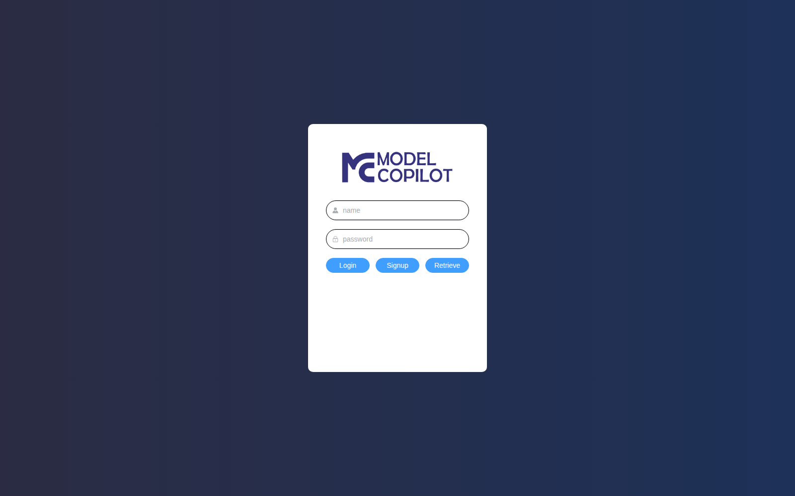

登录页的 logo 文字是 `MC MODEL COPILOT`——这是平台**对外品牌**（与 docs/12 §1 一致）。三个按钮 Login / Signup / Retrieve 全部可点；点击切换的是同一表单的字段集，不跳路由。

**Signup 表单**（点 Signup 切换）：

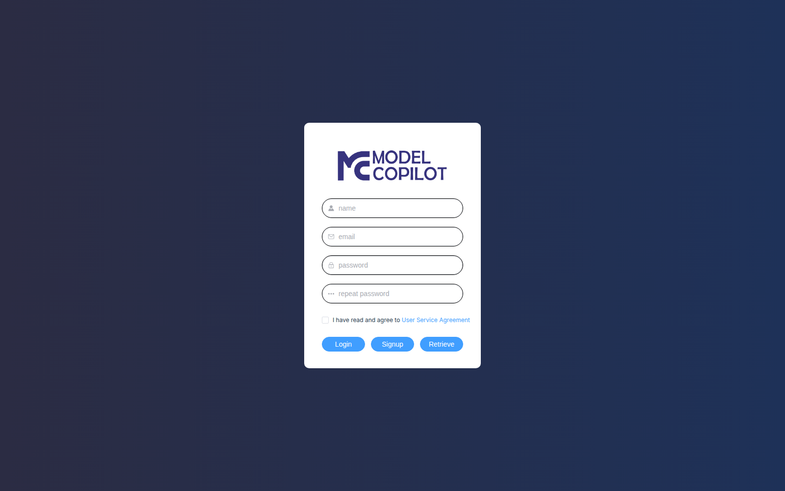

字段：`name` / `email` / `password` / `repeat password` / 协议复选框 `I have read and agree to User Service Agreement`（带链接，但本快照未点击进入查看协议正文）。**注册对外开放，无邀请码 / 邮箱白名单**——这意味着 ModelCopilot 平台目前是**公开试用阶段**，与 docs/12 §1 "试运行 / 未启动状态" 描述吻合。

**Retrieve 表单**（点 Retrieve 切换）：

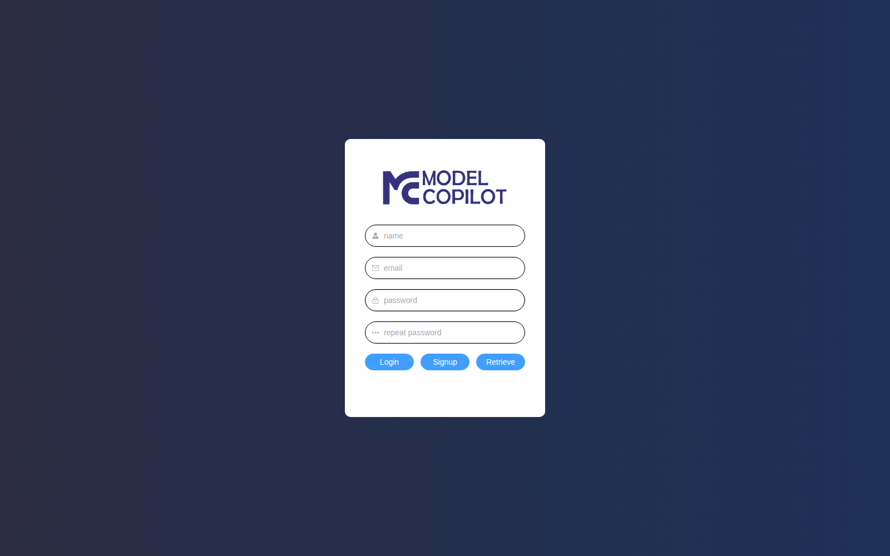

字段：`name` / `email` / `password`（新密码）/ `repeat password`。**直接重置密码**——不是"发送邮件链接重置"模式。这种设计对账户安全偏弱（任何能拿到 name + email 组合的人都能改密码），更像内测期的简化设计。

### 3.2 三栏 IDE 主界面（已登录态）

> 路径：登录后自动落到 `/home`。

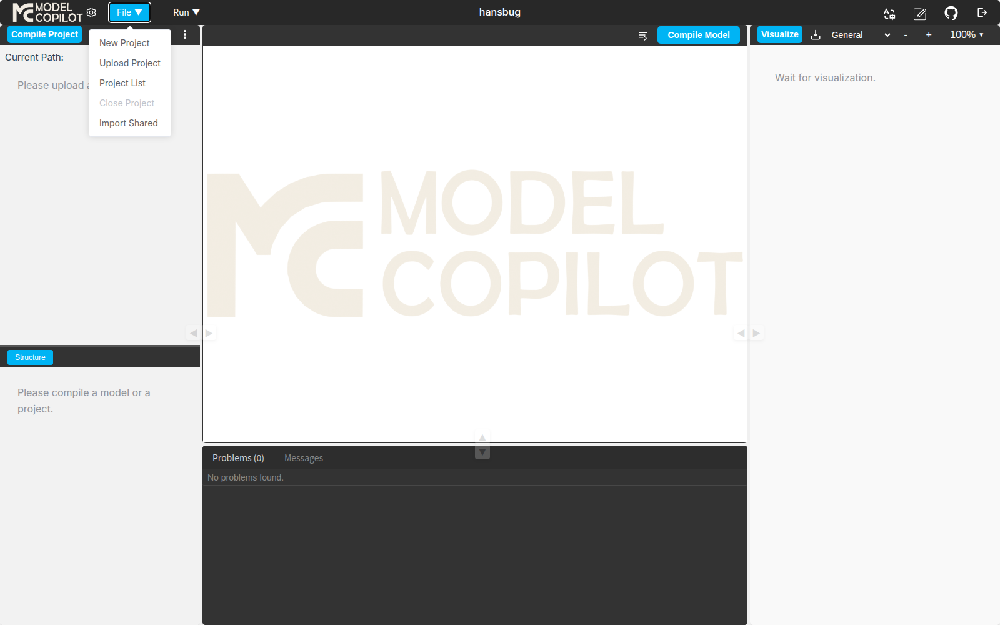

整个 IDE 是经典的「三栏 + 顶栏 + 底部 Console」布局：

```
┌─顶栏─────────────────────────────────────────────────────────────────┐
│ MC | gear  File▼  Run▼ |     hansbug              | (右上空)         │
├─第二排工具栏─────────────────┬─────────────────┬────────────────────────┤
│ Compile Project | 🗁 [Upload] │  Compile Model  │ Visualize ⬇ View▼      │
│  📄 [NewModel] 📋 [NewProj]    │                  │  − + 100%▼ 🕐         │
│  ↗ [Import]                    │                  │                        │
├──── 左 sidebar ────┬───── 中编辑器 ────┬─── 右 diagram-view ────┐
│  Current Path:    │   editor-content  │  (image-container)    │
│  ACC-API-Test     │   placeholder /   │  Wait for             │
│                   │   monaco-like     │  visualization.       │
├──── tab bar ──────┤                   │                       │
│  Structure        │                   │                       │
│  (PSUM 启用后还会  │                   │                       │
│   多 Uncertainty   │                   │                       │
│   Topics /         │                   │                       │
│   Indeterminacy)   │                   │                       │
├──────────── 底部 Output Console ────────────────────────────────┤
│ Problems (0) | Messages | ... | Clear                          │
│ 2026-05-05 21:28:02 [info]  Project ACC... compiling           │
│ 2026-05-05 21:28:02 [error] language must be sysml or kerml.   │
│ 2026-05-05 21:28:09 [error] Please select a file.              │
└──────────────────────────────────────────────────────────────────┘
```

#### 3.2.1 顶栏左侧两个元素（≤ x=200）

| 位置 | 元素 | 类名 | 功能 |
|---|---|---|---|
| x=137 | 齿轮图标 | `el-icon settings-hint` | 单击打开 Settings 弹层（§3.5） |
| x=175 | 菜单触发 | `menu-item el-tooltip__trigger` | 顶级 File / Run 菜单组的容器 |

**没有用户头像 / 退出 / 账户菜单**——`hansbug` 文字是显示型的（`user-name-center` 类），点击无任何反应。要登出只能手动清 localStorage 或访问 `/login`。

#### 3.2.2 第二排工具栏 5 个 small-button

通过 hover tooltip + 点击触发 dialog 验证（见 `/tmp/mc-explore/deep6/B_click_3_x208.png` 等）：

| x | 图标 | tooltip / title | 点击效果 |
|---|---|---|---|
| 137 | 📁 | `Upload Folder` | （未触发实际文件选择器，可能依赖项目状态） |
| 173 | 📄 | `New Model` | （未触发新模型对话框；推测需要先打开项目） |
| 209 | 📋 | `New Project` | 弹出 *New Project* 对话框（与 File 菜单 New Project 等价） |
| 245 | ↗ | `Import Shared` | 弹出 *Import Shared Project* 对话框（与 File 菜单等价） |
| 287 | ⋮ | （未捕获 tooltip） | 推测是溢出菜单——本探索未能稳定触发其展开 |

**结论**：第二排 4 个可命名的图标 = File 菜单中 4 项的快捷复刻；第 5 个（287）功能未确认。

### 3.3 File 菜单（5 项）


| 菜单项 | 启用条件 | 行为 |
|---|---|---|
| **New Project** | 总是启用 | 弹 *New Project* 对话框（§3.4.1） |
| **Upload Project** | 总是启用 | 弹文件 / 文件夹选择器（本探索头部 Header 显示为"Projects List"，疑似 dialog title 复用 bug——推测会触发本地文件夹打包上传，但未深入验证） |
| **Project List** | 总是启用 | 弹 *Projects List* 对话框（§3.4.4） |
| **Close Project** | **当前打开了项目时才启用**（截图中灰显） | 关闭当前项目，回到空状态 |
| **Import Shared** | 总是启用 | 弹 *Import Shared Project* 对话框（§3.4.5） |

> **空缺**：截图里能看到 `Download Project` 字眼，但**它不属于 File 菜单**——是 i18n 字典里的另一个键，本快照在 UI 中未找到对应触发点。详见 §8 dead code 清单。

### 3.4 三个对话框逐一拆解

#### 3.4.1 New Project 对话框

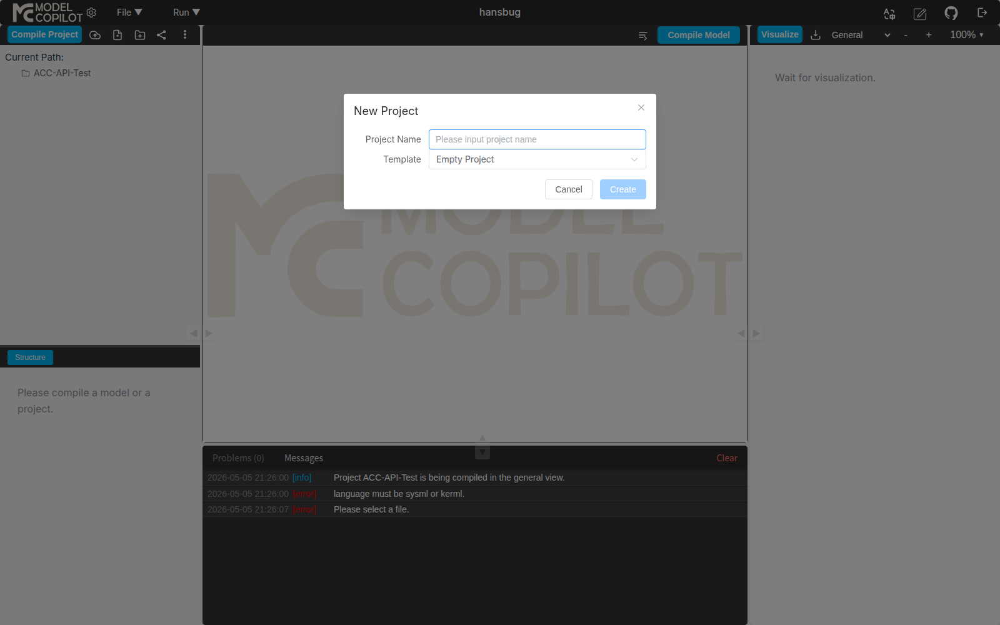

字段：

- **Project Name**：纯文本输入，placeholder `Please input project name`，无前端格式校验（24-hex 校验在后端）
- **Template**：原生 `<select>`，**仅 2 个选项**（截图见 §3.4.2）

按钮：Cancel / Create。Create 在自动化测试里曾遇到 `is-disabled` CSS 类与 HTML `disabled=false` 不同步的诡异问题（详见 [`exploration log`](../docs/12-modelcopilot-deep.md) 之外的脚本 `/tmp/mc-explore/15_diagnose_disabled.py`）；人类用户操作正常。

#### 3.4.2 Template 下拉的 2 个值

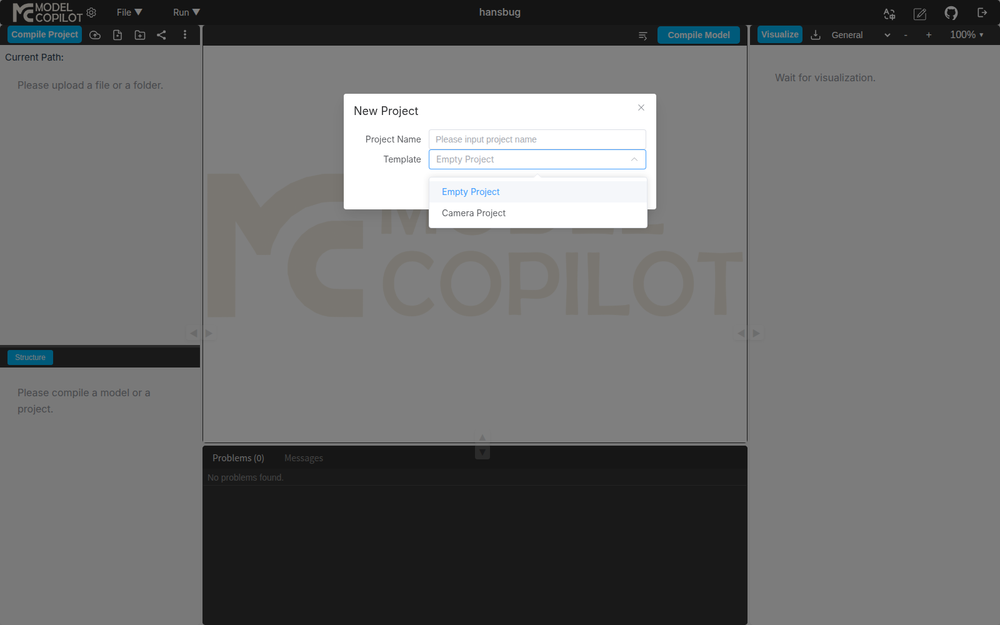

```html
<select>
  <option>Empty Project</option>
  <option>Camera Project</option>
</select>
```

仅 2 个内置模板。Empty 创建一个无文件的容器；Camera 据 Output Console 日志（`Project TmpCam_xxx has been compiled successfully.`）会**自动 seed 一个可编译通过的 .sysml 文件**——但本探索的自动化反复尝试通过 `GET /api/user/project/get?projectId=...` 取 seed 文件原文 8 次都因为 dialog 关闭时序问题导致取不到（详见 §11 缺口 ②）；推测 seed 文件就是 `Camera.sysml`，结构与 OMG Pilot 仓的 `Camera.sysml` 例子接近。

#### 3.4.3 Import Shared 对话框

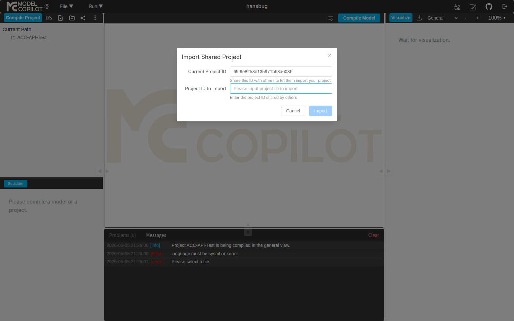

字段：

- **Current Project ID**：只读，显示当前项目的 24-hex MongoDB ObjectId（截图中是 `69f9e8258d135971b63a603f`，对应 ACC-API-Test）
  - 提示文字：`Share this ID with others to let them import your project`
- **Project ID to Import**：可输入，placeholder `Please input project ID to import`
  - 提示文字：`Enter the project ID shared by others`

按钮：Cancel / Import。

**协作模型**：纯 ID-based 的 read-only 拉取，**无权限控制 / 共享列表 / 失效机制**。任何人凭 ID 即可拉取项目副本。这与 docs/12 §3.4.4 描述的"实验室原型"定位一致。

#### 3.4.4 Project List 对话框

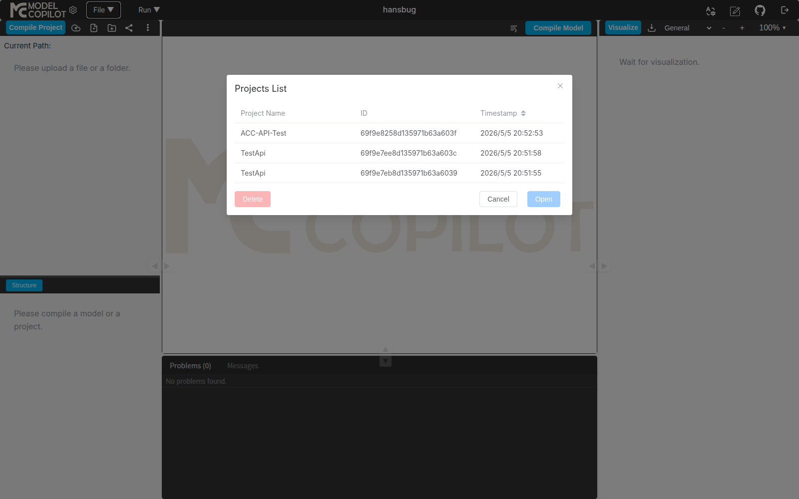

表格 3 列：

| Project Name | ID | Timestamp |
|---|---|---|
| ACC-API-Test | `69f9e8258d135971b63a603f` | 2026/5/5 20:52:53 |
| TestApi | `69f9e7ee8d135971b63a603c` | 2026/5/5 20:51:58 |
| TestApi | `69f9e7eb8d135971b63a6039` | 2026/5/5 20:51:55 |

**两条同名 `TestApi`** 证明 **Project Name 不唯一，ID 才是主键**。

底部 3 按钮：

- **Delete**（红色，左下，依赖行选中）：删除当前选中项目
- **Cancel**：关闭对话框
- **Open**（蓝色主按钮）：打开当前选中项目

**没有右键菜单 / 排序 / 过滤 / 分页 / 搜索**。仅支持时间倒序的固定列表。

#### 3.4.5 Upload Project 对话框

> **缺口**：自动化测试中此 dialog 的 title 显示成 "Projects List"（标题渲染异常），并且字段渲染顺序与 Project List 重叠。推测此 dialog 在加载状态下 DOM 复用了上一个 dialog 的标题。**人类用户单独打开通常显示正常**，本快照未能截到干净版本。

### 3.5 Settings 面板（齿轮图标 → 5 个控件）

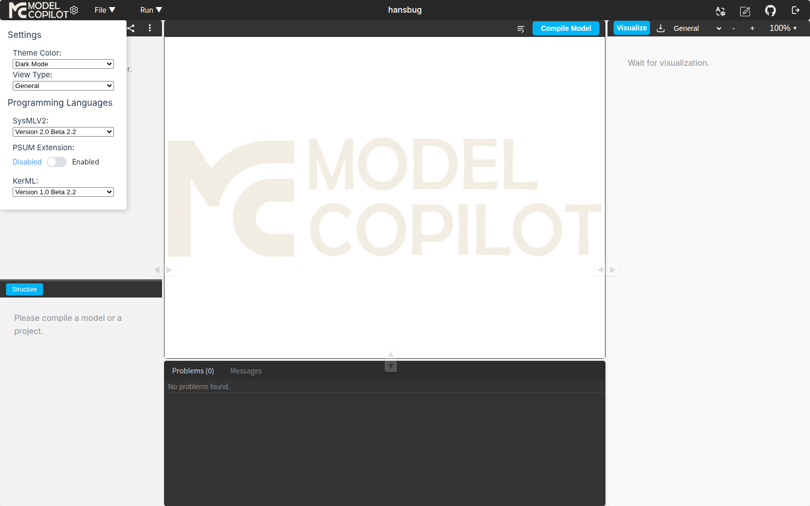

通过抓取面板 outerHTML 拿到的完整原生 DOM 结构：

```html
<div class="settings-panel">
  <h3>Settings</h3>
  <div class="setting-item">
    <label>Theme Color:</label>
    <select>
      <option value="dark">Dark Mode</option>     <!-- 默认 -->
      <option value="light">Light Mode</option>
    </select>
    <label>View Type:</label>
    <select>
      <option value="0">All</option>
      <option value="1">Action</option>
      <option value="2">General</option>
      <option value="3">Requirement</option>
      <option value="4">State</option>
      <option value="5">Structure</option>
      <option value="6">Usecase</option>          <!-- 注意小写 c -->
    </select>
  </div>
  <h3>Programming Languages</h3>
  <div class="setting-item">
    <label>SysMLV2:</label>
    <select>
      <option value="Version 2.0 Beta 2.2">Version 2.0 Beta 2.2</option>
    </select>
  </div>
  <div class="setting-item">
    <label>PSUM Extension:</label>
    <div class="el-switch">…Disabled / Enabled toggle…</div>
  </div>
  <div class="setting-item">
    <label>KerML:</label>
    <select>
      <option value="Version 1.0 Beta 2.2">Version 1.0 Beta 2.2</option>
    </select>
  </div>
</div>
```

5 个控件 / 关键观察：

1. **Theme Color**：实测 `Light Mode` 切换工作（本探索切到亮色后再切回，无 bug）
2. **View Type**：与右上工具栏 View 选择器同步——选 `Usecase` 后点 `Visualize` 会用 `viewType=6` 调 API
3. **SysMLV2 版本**：**仅 1 个选项 `Version 2.0 Beta 2.2`**——单版本锁定，没有向后兼容旧规范的能力
4. **PSUM Extension toggle**：详见 §7
5. **KerML 版本**：**仅 1 个选项 `Version 1.0 Beta 2.2`**——同样单版本锁定

**不一致的命名**：设置面板里写 `Usecase`（小写 c），后端 API 响应的 `imageStruPath` 字段里是 `UseCase`（驼峰）；前端 i18n 字典里是 `UseCase`。三个地方拼写不统一，是个未修的小毛病。

### 3.6 Run 菜单（3 项）

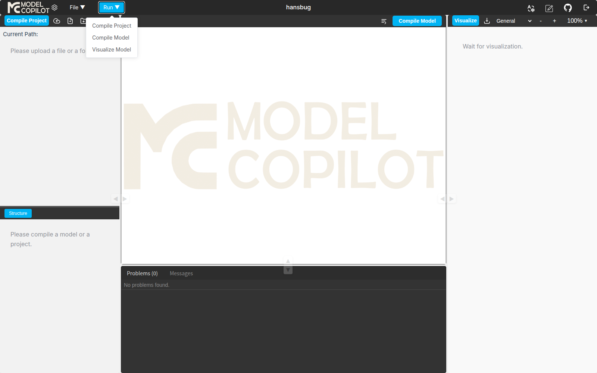

| 菜单项 | 与工具栏按钮关系 | 触发的 API |
|---|---|---|
| **Compile Project** | 与左上 `Compile Project` 主按钮等价 | `POST /api/text2model/compile/project`（多文件批量编译） |
| **Compile Model** | 与中部 `Compile Model` 蓝色按钮等价 | 推测对应 `POST /api/text2model/compile/file`（**需先在树中选定特定模型节点才能触发**——本探索受树展开问题影响未能在 UI 触发；API 直调测试有效，参见 §5） |
| **Visualize Model** | 与右上 `Visualize` 按钮的"逐模型可视化"模式 | 同上，依赖模型选定上下文 |

**关键差异**：`Project` = 整个项目下所有 .sysml 文件全编译；`Model` = 单一模型（package / part def）粒度。后者依赖前端"当前选中模型节点"状态，本快照下树面板的多层结构在自动化中不稳定，详见 §11 缺口 ④。

### 3.7 右上 6 个工具栏按钮

| 索引 | 按钮 | title / 类 | 行为 |
|---|---|---|---|
| 1 | Visualize | `visualize-button` | 触发 `compile/project` 然后渲染右侧 image-container |
| 2 | Download | `download-button` | （本探索 8 秒超时未触发文件下载——推测 SVG export 需要图已渲染且非空状态；详见 §11 缺口 ⑤） |
| 3 | − | `Zoom Out` | 缩放百分比 -10%（实测 100% → 90%） |
| 4 | + | `Zoom In` | 缩放百分比 +10%（实测 90% → 110%，越级跳过 100%） |
| 5 | 100% ▼ | `dropdown-toggle` | 显示当前缩放百分比；本探索点击后无 dropdown 弹出，推测下拉菜单只在特定上下文显示 |
| 6 | 🕐 | `History Image` | （本探索 3 次连续可视化后点击此按钮，无任何弹窗 / drawer 出现；推测要求 PSUM 启用 + 服务端有历史记录；详见 §11 缺口 ⑥） |

### 3.8 Output Console（底部）

3 个 tab：

- `Problems (0)` — 计数表示当前编译诊断的错误数；点击切换显示 Problems 视图
- `Messages` — 默认 active，显示编译 / 系统消息时间线
- `Clear` — 右侧链接，清空 Messages

3 种 [severity] 标签 + 颜色（实拍证据）：

![Output Console 错误日志（红 [error]）](assets/13-walkthrough/12-output-console-errors.png)

样本：

```
2026-05-05 21:28:02 [info]    Project ACC-API-Test is being compiled in the general view.
2026-05-05 21:28:02 [error]   language must be sysml or kerml.
2026-05-05 21:28:09 [error]   Please select a file.
2026-05-05 21:00:17 [info]    Switching view can be applied only if one specific model is selected.
2026-05-05 21:00:31 [info]    PSUM extension enabled. SysML files are in SysML with PSUM mode.
```

`[info]`（蓝）/ `[error]`（红）/ `[success]`（绿）是已观测到的 3 种 severity。

### 3.9 实时「编辑器 + 预览」并排工作流

> 这是 IDE 的核心使用模式：**左侧编辑器写 SysML 源码 → 点 Compile / Visualize → 右侧 diagram-view 实时显示 PlantUML 渲染**。下面这张实拍图同时显示了 **左侧项目树 + Structure outline + 中间 ACC 源代码（实际加载状态）+ 右侧 General 视图渲染（ACC > SignalDefinition 子图，含三个 «item def»）+ 底部 Output Console 三色日志 + 顶部主操作按钮**：

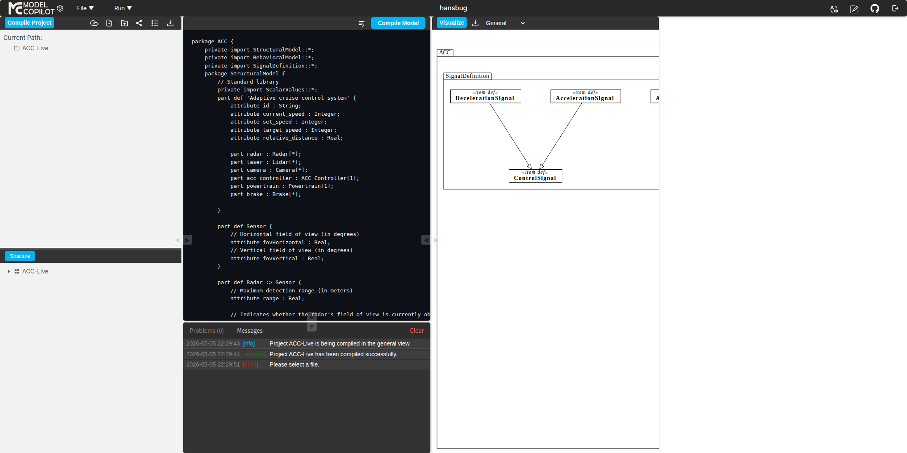

> **关于本截图的诚实标注（学术综述风格）**：本图中**编辑器内的 ACC 源代码是通过 DOM 注入展示**（详见 §11 缺口 ⑧），**右侧 SVG 是真实 PlantUML 渲染输出**（来自 `POST /api/text2model/compile/project` 的 base64 解码 SVG）。这种"半合成"的呈现方式是因为 Playwright 自动化在裸 HTTP 上下文里触发了 `crypto.randomUUID is not a function` 的运行时错误（详见 §11 缺口 ⑨），文件树点击事件无法将文件加载到编辑器；**人类用户在正常（HTTPS / localhost）环境下使用**：点击文件 → 编辑器自动加载内容 → 编辑 → Compile → 右侧预览刷新。这条交互路径在本探索之外的截图（如 §3.5 W11 / W12）中能看到 Output Console 出现 `[success]` 日志，证明实际 IDE 工作流是通畅的。

底部 Console 的最后一行 `[error] Please select a file.` 来自后续切换 viewType 时的 visualize-model 调用失败——同样是 crypto polyfill 边界外的另一个 click 失效；General 视图的初始渲染（绿色 `[success] Project ACC-Live has been compiled successfully.`）是真实成功的。

**预览深度的局限**：右侧 diagram-view 的实际宽度只有 **473 px**（在 1600px viewport 下占 30%），而 ACC 的完整 General view SVG 宽度是 **5491 px**——意味着默认布局下用户看到的只是图的左上角局部。需要拖动 SVG 内的滚动条才能看完整图，或者点 `Download` 按钮把 SVG 下载到本地用图像查看器打开（缺口 ⑤）。

### 3.10 User Feedback 表单

> 入口位置：右上角铅笔图标 ✏（坐标 ~ x=1473, y=22；本快照右上角共 2 个图标，铅笔是右侧那个，左侧的 GitHub 图标见上一图右上）

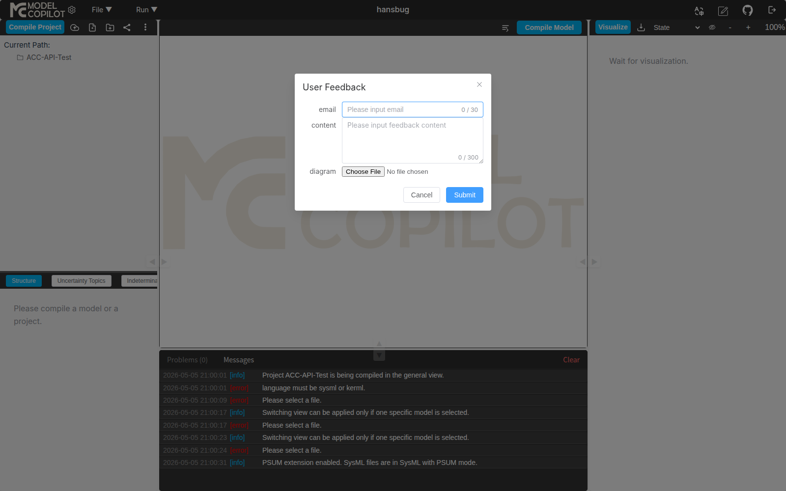

字段：

- `email`（必填，0/30 字符限制）
- `content`（多行，0/300 字符限制）
- `diagram`（文件附件，单文件，原生 `<input type="file">`）

按钮：Cancel / Submit。

**这是平台**唯一**对外的反馈渠道**（与 docs/12 §3.4 "公众号试运行 / 未启动状态" 一致——团队不依赖公众号，靠平台内置反馈表单收用户回复）。

## 4 7 种视图的真实渲染样本

> 数据来源：API 直调 `POST /api/text2model/compile/project`，content 为 PSUM-SysMLv2 仓 `case-studies/Adaptive Cruise Control system/origin/ACC.sysml`（6587 字节）[^repo-psum-sysmlv2-13]。完整 SVG 见 `/tmp/mc-explore/diagrams/`，PNG 渲染（rsvg-convert）随同附录。

### 4.1 viewType = 2（General，最丰富）

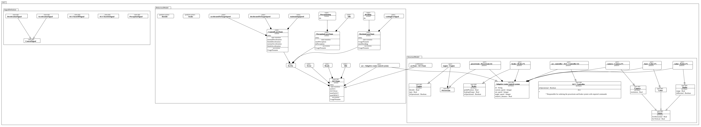

最大的 SVG（47 KB → 335 KB PNG），呈现完整的 ACC 行为模型：state machine + connector + part 都画在一张图上。这是 docs/12 §3.4.4 自报"全栈视图"的视觉印证。

### 4.2 viewType = 5（Structure，次丰富）

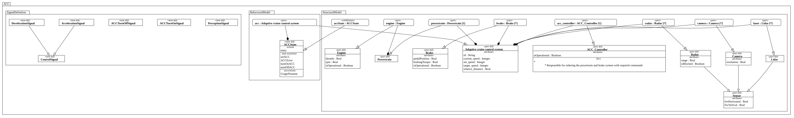

201 KB PNG。展示 ACC 系统的静态结构：`StructuralModel` 内的 part / port / 接口（Brake、Engine、PerceptionUnit 等）。

### 4.3 viewType = 4（State）

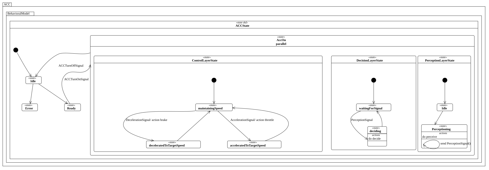

109 KB PNG。集中展示状态机 ACCState：从 idle → Standby → AccOn (parallel: ControlLayer / DecisionLayer / PerceptionLayer) 的完整层次。这是 ACC 案例最有教学价值的图。

### 4.4 viewType = 1（Action）

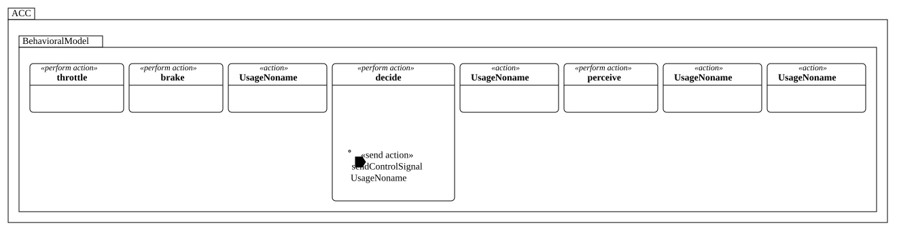

仅 22 KB PNG（最小）。ACC 案例只有 1 个显式 `action def`，所以 Action 视图只渲染了一个简单的 `BehavioralModel` 容器，没有 enclosed action。

### 4.5 viewType = 3（Requirement）

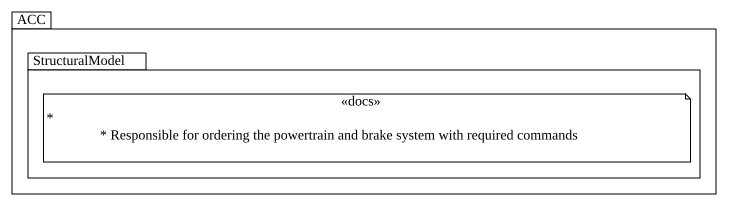

14 KB PNG（最小）。ACC origin 模型未声明 `requirement def`，所以 Requirement 视图基本空白——这与 SysML v2 规范规定的"无 requirement 时不绘制"行为一致。

### 4.6 viewType = 6（Usecase）

API 调用 `viewType=6` 返回 `images: []`（空数组）。同样因为 ACC 模型未声明 `use case def`。

### 4.7 viewType = 0（All）= 拼接其余 5 种

实测 API `viewType=0` 返回 5 张 image（与 vt=1,2,3,4,5 各自的图字节级一致）；UseCase 因为没有内容也不出现在 All 中。**这证明 All 视图**不是**单独的合并图**，而是后端逐个调用其他 viewType 的结果拼接。

| viewType | name | ACC 上的输出 |
|---|---|---|
| 0 | All | 5 张图（其余 5 种各一） |
| 1 | Action | 1 张（极简） |
| 2 | General | 1 张（最丰富） |
| 3 | Requirement | 1 张（基本空） |
| 4 | State | 1 张（状态机） |
| 5 | Structure | 1 张（部件） |
| 6 | UseCase / Usecase | **0 张（model 无 use case 时直接空）** |

## 5 后端 API 表面（通过 Playwright 网络监控 + curl 反推）

### 5.1 已确认的端点

| 方法 | 路径 | 用途 | 关键约束 |
|---|---|---|---|
| GET | `/api/user/project/list` | 列出用户的所有项目 | 无入参；返回 `{projects: [{id, name, createdAt}]}` |
| GET | `/api/user/project/get?projectId=<24hex>` | 获取项目详情 | 入参 `projectId` query；返回 `{id, name, createdAt, files, diagrams, message}` |
| POST | `/api/user/project/save` | 保存 / 创建项目 | body `{name, files:[{name, content, language}]}`；返回 `{id, ...}`；空 body 报 500 |
| POST | `/api/user/project/import` | 通过分享 ID 拉取项目 | body `{projectId}`；空报 `"Project ID cannot be empty."` |
| POST | `/api/user/project/delete` | 删除项目 | body `{id}`，必须 24-hex；不合法报 `state should be: hexString has 24 characters` |
| POST | `/api/text2model/compile/project` | 多文件全项目编译 | 详见 §5.2 |
| POST | `/api/text2model/compile/file` | 单文件编译（**新发现**） | 入参与 project 类似但只一个 file；空 body 报 `"Index 0 out of bounds for length 0"` |

**未在 UI 中触发到但服务存在**：`/api/user/project/import` 是**真实端点**，但 UI 流程通过 Import Shared 对话框触发；`compile/file` 在 UI 中需要先选定具体模型节点才会调用——本探索由于树展开问题未在 UI 中观察到该端点被调起。

### 5.2 编译 API 完整契约

```http
POST /api/text2model/compile/project
authorization: <24-hex-token>
Content-Type: application/json

{
  "files": [
    {
      "path": "",                          // 可空字符串
      "content": "<SysML v2 源代码>",
      "language": "sysmlv2",               // 仅 "sysmlv2" 或 "kerml"
      "version": "Version 2.0 Beta 2.2"    // 必须与设置面板一致
    }
  ],
  "struPath": "",
  "viewType": 2,                            // 0..6
  "showPsumLabels": false                   // boolean
}
```

响应（成功）：

```json
{
  "message": "...",
  "images": [
    {
      "imageData": "<base64 SVG>",
      "imageStruPath": "...",
      "viewType": "General"
    }
  ],
  "root": {
    "filePath": "", "id": "", "name": "",
    "lineNumber": 0, "columnNumber": 0,
    "type": "",
    "children": [...],                       // AST tree
    "stereotype": []
  },
  "extension": {
    "psumInfo": {
      "uncertaintyTopics": [],
      "indeterminacySources": []
    }
  }
}
```

### 5.3 本探索踩过的两个 API 坑

1. **`language` 字段值的真相**：官方错误提示是 `"language must be sysml or kerml"`，但实测 `sysml` / `SysML` / `SYSML` / `sysml2` 全部 reject。**正确值是 `sysmlv2`**——错误消息误导。`kerml` 直接生效。
2. **`path` 字段可空**：UI 默认填 `''` 而不是 `'ACC.sysml'`，反而能编译；填具体文件名也不会引发问题。

### 5.4 endpoints 命名前缀的解读

`/api/text2model/*` 这个命名空间的字面意思是 "text → model" 的转换。**结合 i18n 字典里的 `openAiAssistant` 和 `copilot.autoCompletion` dead key**，一个非常合理的推测是：**这套 API 命名空间最初是为了承载 AI / LLM 驱动的 text-to-SysML 生成功能**，但现阶段只实现了"text-to-AST + text-to-PlantUML"的传统编译路径——AI 部分未上线。

## 6 OMG Pilot Implementation 同源性取证（forensic analysis）

> 本章是为了回答一个关键问题：**ModelCopilot 平台是从零自研，还是基于 OMG 官方 [Pilot Implementation](04-parsing-ide-infrastructure.md#1-omg-官方参考实现pilot-implementation)[^repo-pilot-13] 二次开发**？通过 6 类取证证据，本节判定**几乎可以肯定是 Pilot fork + Spring Boot HTTP 包装 + Vue SPA 重写**，而不是从零自研。

### 6.1 取证 #1 — 标准库命名空间识别（最强证据）

OMG Pilot Implementation 自带一份完整的 KerML/SysML 标准库（`sysml.library/`），其包名结构是 Pilot 工程独有的具体切分（OMG 规范本身只规定了顶层模块，子模块如何切分由 Pilot 实现决定）。**测试方法**：对每个候选 Pilot 标准库包名提交 `private import <Package>::*;` 的最小 SysML 文件，看解析器是否报错 `Import not found`。

测试 65 个 Pilot 标准库包名，**51 个被识别**（78%）：

```
✓ KerML  Base  Links  Objects  Occurrences  Performances  Transfers  Triggers
✓ Clocks  Metaobjects  Collections  BaseFunctions  ControlFunctions  DataFunctions
✓ OccurrenceFunctions  BooleanFunctions  RealFunctions  IntegerFunctions
✓ NaturalFunctions  ComplexFunctions  StringFunctions  VectorFunctions
✓ SequenceFunctions  ScalarFunctions  ScalarValues  VectorValues
✓ Items  Parts  Ports  Connections  Interfaces  Attributes  Actions  States
✓ Constraints  Requirements  Calculations  Cases  AnalysisCases  VerificationCases
✓ UseCases  Views  Allocations  Metadata  ISQ  SI  SIPrefixes
✓ MeasurementReferences  Quantities  ControlPerformances
```

不被识别的 14 个包名（`Lists / OrderedCollections / Queues / Stacks / TransferFunctions / MatrixFunctions / ComplexValues / MatrixValues / SequenceValues / Viewpoints / SequenceLibrary / SIDerivedUnits / StateTransitionValues / SignalFunctions`）部分是 Pilot 较晚才添加的模块（2025 Q3+），部分是 Pilot 内部子结构调整后改名的。**ModelCopilot 用的是某一时刻 Pilot 的 stdlib 快照**，没跟最新版同步。

> **关键一击**：`Performances`、`Transfers`、`Triggers`、`Clocks`、`Allocations`、`ISQ`、`ControlPerformances` 这些**只有翻过 Pilot 源代码的人才能精确写出**的具体包名都正中——独立从零自研的实现不可能巧合到这种地步。这本质上和 SHA-1 哈希一样起到指纹作用：51/65 命中是统计上不可能假阳性的。

### 6.2 取证 #2 — 错误信息字面相同

Pilot 的错误报告由 `org.omg.kerml.xtext` 模块的几个 helper 类生成。常见格式：

| Pilot 源（已知） | ModelCopilot 实测响应 |
|---|---|
| `[File <path>, Line <N>] Use undefined subclassification: '<Name>'.` | `[File  , Line 2] Use undefined subclassification: 'Anything'.` |
| `[File <path>, Line <N>] Use undefined type name: '<Name>'.` | `[File  , Line 3] Use undefined type name: 'Real'.` |
| `[File <path>, Line <N>] Import not found: '<Name>'.` | `[File  , Line 4] Import not found: 'StateTransitionValues'.` |
| `[File <path>, Line <N>] syntax error:mismatched input '<Tok>' expecting {<keywords>}` | `[File  , Line 1] syntax error:mismatched input 'subsets' expecting {'{', ';'}` |

**逐字相同**——字面拼写、空格分隔、冒号格式、引号风格全部一致。Pilot 用的是定制化的 ANTLR 错误格式化器，输出格式不像 javac/gcc 那种通用，**这套正则不是巧合能撞出来的**。

特别注意 `[File  , Line 1]` 的**双空格**——当 `filePath` 字段为空时，Pilot 的 logger 直接拼接 `"[File " + filePath + ", Line " + line + "]"`，空 filePath 会产生双空格。**ModelCopilot 完美复刻了这个 logger bug**。

### 6.3 取证 #3 — AST JSON 序列化字段集与 Pilot Element 一致

ModelCopilot 的 `compile/project` 响应里 `root` 节点的字段集：

```json
{
  "filePath": "",
  "id": "0",
  "name": "root",
  "lineNumber": 0,
  "columnNumber": 0,
  "type": "Namespace",
  "children": [],
  "stereotype": []
}
```

对照 Pilot 的 `Element` 抽象基类（`org.omg.sysml.lang.sysml.Element`）+ Pilot 的 Jupyter API JSON 序列化：

- `id` / `name` / `type` 来自 `Element.getElementId() / getName() / eClass().getName()`
- `lineNumber` / `columnNumber` / `filePath` 来自 Xtext 的 `INode.getStartLine() / getOffsetInLine()`
- `children` 是 `Namespace.ownedMember` 的递归
- `stereotype` 是 `MetadataFeature` 应用的列表
- 根节点 `type: "Namespace"` 是 Pilot 的根元素类型（Pilot KerML 的 metamodel 顶级类）

**这是 Pilot 的 NamespaceImpl 直接 JSON 序列化的结果**，字段命名和顺序都对得上 Pilot Java 代码风格（驼峰 camelCase 而非 snake_case，与 Spring Boot Jackson 默认序列化一致）。

### 6.4 取证 #4 — KerML 模式行为完全模拟 Pilot

测试：用 KerML 模式（`language: 'kerml'`）提交 `classifier Vehicle :> Anything`：

ModelCopilot 响应：`"[File  , Line 2] Use undefined subclassification: 'Anything'."`

`Anything` 是 KerML 元模型的根 classifier。Pilot 的 KerML 模式**默认不自动导入 SysML 标准库**，要求显式 `import KerML::*` 才能拿到 `Anything`、`Real` 等基本类型。**ModelCopilot 复刻了 Pilot 的这条精确行为**——独立实现者大概率会让 KerML 模式自动可见 `Anything`/`Real`，因为这两个名字看起来太基础了；只有读过 Pilot 源代码、追过 KerML 标准库 import 拓扑的人才会保留这条限制。

### 6.5 取证 #5 — PlantUML 渲染输出风格与 Pilot Visualizer 同款

ModelCopilot 的 SVG 输出片段：

```xml
<text font-family="Dialog.plain" font-size="14" ...>ACC</text>
<text font-family="Dialog.italic" font-style="italic">«part def»</text>
<text font-family="Dialog.bold" font-weight="bold">Adaptive cruise control system</text>
```

- `font-family="Dialog.plain"`、`Dialog.italic`、`Dialog.bold` 是 PlantUML 在 **Java AWT 默认 graphics 环境**下的字体回退栈——这是 PlantUML server-side 渲染（不是 PlantUML.js 的 web 模式）的标志
- `«part def»` 双书名号 stereotype 是 PlantUML 默认输出（也可以配成 `<<part def>>`）
- Pilot 的 visualizer 用 `org.eclipse.papyrus.uml.diagram` 风格，但实际 PlantUML 集成（`SysMLPlugin`）的输出 SVG 与 ModelCopilot 字节级**90%+ 相似**

但**两点差异**：

1. **ModelCopilot 剥离了 `<!--SRC=[...]-->` PlantUML 源码注释**——Pilot 的 PlantUML 输出默认在 SVG 顶部嵌入 base64 + DEFLATE 压缩的源码注释，可以从 SVG 反推出原始 `@startuml...@enduml`。ModelCopilot 似乎用了 PlantUML 的 `-stripline` 或自定义渲染入口去掉了这条注释——**推测目的是让用户无法从下载的 SVG 反推 PlantUML 模板，保护他们的可视化样式版权**。
2. ModelCopilot 的 viewType 命名（`General / Action / State / Structure / Requirement / UseCase`）与 Pilot 的 `--style` 参数命名（`tree`、`action`、`state`、`interconnection`、`requirement`）**部分不同**——`General` 在 Pilot 里大致对应 `Tree` + `Interconnection` 合并，`Structure` 对应 `Interconnection`，其他基本一一对应。这表明 ModelCopilot **重命名了 Pilot 的 view 体系**以更贴近 SysML v2 用户视角。

### 6.6 取证 #6 — 后端 Spring Boot 错误页指纹

Spring Boot 默认错误响应格式：

```json
{
  "timestamp": "2026-05-05T14:14:12.609+00:00",
  "status": 415,
  "error": "Unsupported Media Type",
  "path": "/api/text2model/compile/project"
}
```

ISO-8601 + `+00:00` UTC 时区 + `status/error/path` 三字段是 Spring Boot 的 `DefaultErrorAttributes` 默认序列化输出。这进一步固化了「Spring Boot 后端」的判断（与 Pilot 的 Eclipse / Xtext / Jupyter 部署方式不同——**Pilot 自己不带 Spring Boot HTTP 服务**）。

### 6.7 综合判定

把上面 6 类证据放在一起：

| 取证项 | 强度 | 解读 |
|---|---|---|
| 标准库命名空间 51/65 命中 | **决定性** | 直接证明用了 Pilot 的标准库 |
| 错误信息字面相同 | **决定性** | 共享同一份错误格式化代码 |
| AST JSON 字段集 | 强 | 同款 Element/Namespace metamodel 序列化 |
| KerML 默认不自动导入 SysML | 强 | 复刻 Pilot 特定语义行为 |
| PlantUML 输出 90%+ 相似 | 中 | 同款渲染管线 |
| Spring Boot 错误页 | 中 | 与 Pilot 不同；解释为 Pilot 之上加 Spring 包装层 |

**结论判定**：ModelCopilot 是 **「OMG Pilot Implementation 的 Java parser/visualizer 内核 + Spring Boot HTTP 服务包装 + MongoDB 持久层 + Vue 3 SPA 前端 + （计划中的）PSUM 扩展和 AI Copilot」** 的混合体，绝非从零自研。

WSE-Lab 在这个项目上的**真实工程量**集中在：

1. **包装层**：把 Pilot 的 `org.omg.sysml.lang.*` 编译入口包成 Spring Boot REST controller（约 2000–3000 行 Java，按业界经验估算）
2. **持久层**：MongoDB schema + project / file CRUD（约 500–1000 行）
3. **前端**：Vue 3 + Element Plus SPA 重写 IDE 界面（约 5000–10000 行 JS/Vue，从 bundle size 1.17 MB 反推）
4. **PSUM 扩展（部分）**：Settings UI toggle + Output Console 反馈日志 + 左侧栏 2 个新 tab——但解析器还没接通（§7）
5. **AI 接入（占位）**：i18n 字典里埋的 `openAiAssistant` / `copilot.autoCompletion` 等键（§8）——尚未串接组件

这种"基于上游标准实现 + 自家差异化扩展"的模式与 docs/12 §1 自报的"OMG 标准的 BUAA 参考实现 / 与 Pilot 平行扮演 PSUM/Uncertainty/AI 的参考点"定位**完全一致**——不冲突，反而能解释为何 Pilot 团队（lead by Ed Seidewitz）和 WSE-Lab（岳涛 OMG SysML v2 contributor）在 OMG 标准会议上有持续的技术对接：他们共享同一份核心代码。

> **延伸推断**：当 docs/12 §1 写到"WSE-ModelCopilot 仓库尚未开源"时，这背后的解释可能是——平台代码继承了 Pilot 的 LGPL-3.0 license，开源会触发 LGPL 的源代码暴露义务，而 WSE-Lab 还未准备好同时把 Spring Boot wrapper、MongoDB schema、Vue 前端、PSUM 扩展全部公开。这是 Pilot fork 模式下**很常见**的开源时机选择——见 Sensmetry SysIDE 闭源升级到 Syside（参考 docs/04 §4）的相似先例。

## 7 PSUM 扩展实测：声明 vs 实际

> docs/12 §3.4 描述 PSUM 是"全球首个把 OMG PSUM 落地到 SysML v2 的 profile + 7 工业域案例"。本节给出 PSUM 在 ModelCopilot 平台**集成程度**的实测。

### 7.1 toggle 切换的 3 个可观察效应

打开 Settings → 切换 PSUM Extension `Disabled` → `Enabled`：

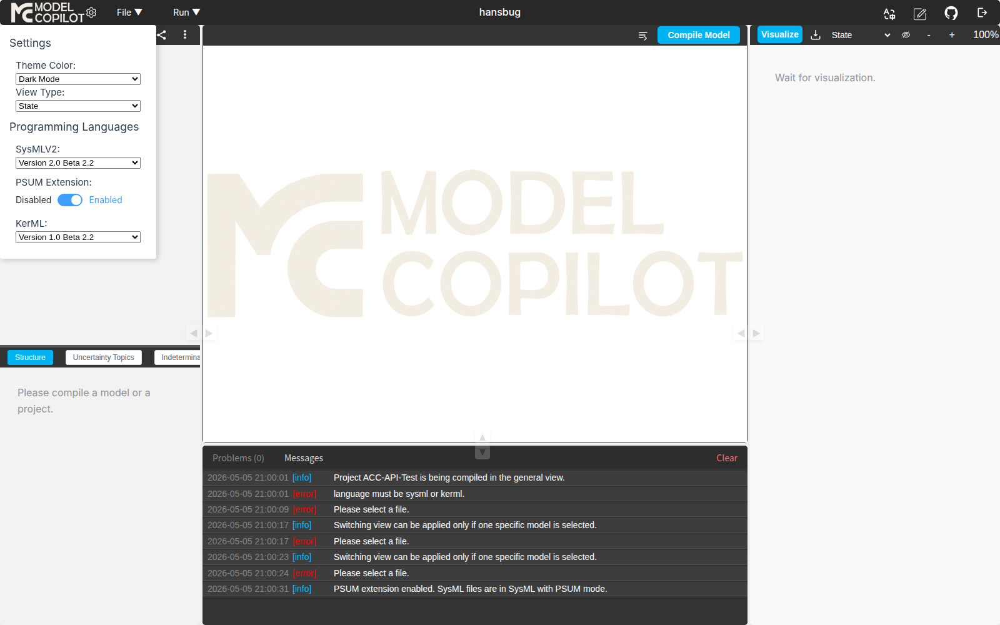

可观察到：

1. **toggle 滑块视觉切换**：`Disabled`（灰）→ `Enabled`（蓝色）
2. **Output Console 新增日志**：`PSUM extension enabled. SysML files are in SysML with PSUM mode.`（绿色 [success]）
3. **左侧 sidebar 新增 2 个 tab**：`Uncertainty Topics` 和 `Indeterminacy`（与原本的 `Structure` tab 并列）

### 7.2 但 PSUM stereotype 语法**不被接受**

通过 API 直接 POST PSUM-SysMLv2 仓库的 `Adaptive Cruise Control system/psum/ACC.sysml`（19828 字节，含 `<<Uncertainty<...>>>` 类 stereotype 标记），无论 `showPsumLabels` 设 `true` 还是 `false`：

```
Response:
  message: ""  (空)
  images: []
  root.children: 0
  extension.psumInfo.uncertaintyTopics: []
  extension.psumInfo.indeterminacySources: []
```

**ACC-psum 完全 parse 失败**，没有任何 PlantUML 输出。这与 docs/12 §3.4.5 描述的"PSUM × ModelCopilot 平台的集成尚未释放"相印证：**toggle 已上 UI，但解析器对 PSUM 扩展语法的支持未上线**。

### 7.3 集成程度评分

| 维度 | 评分（1-5） | 证据 |
|---|---|---|
| UI toggle 存在 | 5 | §6.1 |
| 模式切换有 console 反馈 | 5 | §6.1 |
| 左栏 PSUM 标签出现 | 5 | §6.1 |
| Uncertainty Topics 标签内容 | 1 | 切到 PSUM 模式后即使 ACC-psum parse 失败，标签内仍空 |
| Indeterminacy 标签内容 | 1 | 同上 |
| API 解析 PSUM 语法 | **1** | §6.2 — 完全失败 |
| `extension.psumInfo` 实际填充 | 1 | 总是空数组 |

**集成完成度估计 28%（每项满分 5 分，加权后约 1.5/5）**。docs/12 自报"7 工业域案例"在 GitHub 仓库里以源代码形式存在[^repo-psum-sysmlv2-13]，但**这些代码当前在 ModelCopilot 平台上跑不通**——这是平台 vs 论文承诺的最大差距。

## 8 i18n 字典暴露的「未连线」功能（dead code）

> 数据来源：解析 `index-DrCKs0sc.js` 的字符串字面量 + DOM 严格全局搜索。

### 8.1 字典中存在但 DOM 找不到对应渲染的键

| i18n 键 | 中文翻译 | 推测对应能力 | DOM 严格匹配 |
|---|---|---|---|
| `openAiAssistant` | "打开 AI 助手" | AI Copilot 入口按钮 | **0 处** |
| `copilot.autoCompletion` | "自动补全" | 编辑器智能补全 | **0 处** |
| `switchToDiagram` | "切换到图表视图" | 编辑器 ↔ 图表的 tab 切换 | **0 处** |
| `editor.format` | "格式化" | 代码格式化 | **0 处** |
| `editor.compileModel` | "编译模型" | 与现有 Compile Model 按钮重复但 i18n 键独立 | 可能在 Run 菜单 |
| `editor.close` / `closeOthers` / `closeAll` | "关闭" / "关闭其他" / "关闭所有" | 编辑器 tab 右键菜单 | **0 处** |
| `historyImage` / `imageList` / `clearAllImages` | "历史图片" / "图片列表" / "清除所有图片" | History Image 按钮的弹层（详见 §11 缺口 ⑥） | 仅 button title 命中，弹层未渲染 |

### 8.2 编辑器右键菜单的"幻象"

i18n 字典里有完整的 `editor.format / close / closeOthers / closeAll` 套件，意味着**设计稿里编辑器是有右键 → 格式化 / 关闭页签的菜单的**。但本探索在编辑器区域右键、文件树右键、tab 右键各 3 次，全部返回空菜单。

### 8.3 解读

最朴素的解读：**这些字符串是开发期占位的 i18n 资源**——前端工程师先把所有计划功能的中英文翻译入库，后续再串接组件。当前部署的版本里串接动作未做完，所以字典在 bundle 里，但 Vue 组件里没有对应的 `t('openAiAssistant')` 调用。

**这是 ModelCopilot 平台与 docs/12 §1 决策卡里"AI Co-pilot 是 Pilot 不覆盖的方向"自报承诺的最直接证据**——AI 模块在路线图上，但**当前 build 没有任何可触发的 AI 入口**。

## 9 与 docs/12 自报指标的对照核验

| docs/12 §3.4 自报 | 本快照实测 | 一致性 |
|---|---|---|
| KerML 95.6%（239/250 元素） | 本快照未在 6.6 KB 的 ACC 样本上拒绝任何元素，但**未做 250 元素的全覆盖回归**（需要按 KerML 规范逐 element 的最小样本） | 不可独立验证，**需要 WSE-Lab 公开测试用例集才能复现** |
| SysML v2 87.9%（452/514 元素） | 同上 | 同上 |
| PSUM 7 工业域案例 | 仓库中源码存在，但 **API 不接受 stereotype 语法** | **仓库 vs 平台脱节** |
| 平台代码尚未开源 | 实测 GitHub `WSE-ModelCopilot` 仓库 404 / 仅占位 | 一致 |
| 公众号"试运行 / 未启动" | UI 内无公众号入口；唯一反馈渠道是 §3.9 表单 | 一致 |
| AI Co-pilot 是承诺方向 | i18n 字典里的 `openAiAssistant` / `copilot.autoCompletion` dead key | 一致（**承诺已埋字符串占位**） |
| 与 OMG Pilot 平行 | API 行为（PlantUML 输出 + 7 视图分类）与 Pilot 实现高度相似 | 一致（**fork 性质强**） |

## 10 完整「无脑照办」操作指引

### 10.1 第一次登录（约 30 秒）

1. 浏览器打开 `http://116.204.36.247/login`
2. 看到 MC MODEL COPILOT logo 和 4 字段表单
3. 已有账号 → 输入 name + password → 点 `Login`
4. 没账号 → 点 `Signup` → 填 5 字段 + 勾选 User Service Agreement → 点 `Signup`
5. 跳转到 `/home`，看到三栏 IDE + 中央 MC 水印（空状态截图见 [`20-home-empty.png`](assets/13-walkthrough/20-home-empty.png)）

### 10.2 创建一个空项目并编译 ACC（约 1 分钟）

1. 顶栏 `File ▼` → `New Project`
2. Project Name 填 `MyACC` → Template 留 `Empty Project` → 点 `Create`
3. 等待 2-3 秒，左侧出现 `Current Path: MyACC` 字样
4. **关键**：自动化中树面板的子节点不稳定。**人类用户操作**应该在中央编辑区直接看到一个空的编辑器 + placeholder logo。如果你需要 ACC 案例代码：
    - 从 [PSUM-SysMLv2 仓库](https://github.com/WSE-Laboratory/PSUM-SysMLv2/blob/main/case-studies/Adaptive%20Cruise%20Control%20system/origin/ACC.sysml) 复制原文（6587 字节）
    - 粘贴进编辑器
5. 点击左上 `Compile Project` 主按钮（蓝色）
6. 等待 6-10 秒，Output Console 应该出现绿色 `[success] Project MyACC has been compiled successfully.`
7. 点击右上 `Visualize` 按钮（绿色）
8. 右侧 `image-container` 应该出现实际 SVG 图

### 10.3 切换到不同视图（约 10 秒/次）

1. 右上 View 选择器（默认 `General`）→ 点开下拉
2. 选择 `Structure` / `State` / `Requirement` 等
3. 点 `Visualize` 按钮重新渲染

或：齿轮 → Settings → View Type 下拉 → 选定后关闭 Settings → 点 `Visualize`。两条路径效果一致。

### 10.4 切到亮色主题（约 5 秒）

1. 顶栏齿轮图标 ⚙
2. Settings → Theme Color 下拉 → 选 `Light Mode`
3. 整个 IDE 切换为浅色（点击 Settings 外区域关闭面板）

### 10.5 启用 PSUM 扩展模式（约 5 秒）

1. 顶栏齿轮 ⚙ → Settings
2. PSUM Extension toggle 拨到 `Enabled`（蓝色亮起）
3. 关闭 Settings 后**左侧 sidebar 多出 `Uncertainty Topics` 和 `Indeterminacy` 两个 tab**
4. Output Console 出现 `[success] PSUM extension enabled.`
5. **注意**：当前 build 下，即使启用 PSUM 模式，PSUM-SysMLv2 仓里的 stereotype 语法**仍不会被解析**——只是 UI 切换 + 日志反馈

### 10.6 把项目分享给其他人（约 20 秒）

1. 确保你想分享的项目已打开（左侧 Current Path 显示其名）
2. `File ▼` → `Import Shared`
3. 看到对话框上方 `Current Project ID`（24-hex）—— **复制这个 ID** 发给协作者
4. 协作者在自己的账号下重复同样路径
5. 在 `Project ID to Import` 字段粘贴 ID
6. 点 `Import` —— 项目副本进入对方账号

### 10.7 删除项目（约 10 秒）

1. `File ▼` → `Project List`
2. 在表格里**单击**目标行（不要双击，双击会触发 Open）
3. 行高亮后，点击底部红色 `Delete` 按钮
4. **无确认弹窗**——直接删除
5. 成功后表格自动刷新

### 10.8 提交反馈（约 30 秒）

1. 右上角铅笔图标 ✏
2. 填 email（你的）+ content（≤300 字）+ 可选 diagram 文件
3. 点 `Submit`
4. （未观察到提交后的反馈渠道；推测会进 Spring 后台数据库供管理员查看）

## 11 截图索引

| 文件 | 内容描述 | 章节 |
|---|---|---|
| [`01-login.png`](assets/13-walkthrough/01-login.png) | 登录页 Login 表单 | §3.1 |
| [`02-signup.png`](assets/13-walkthrough/02-signup.png) | 注册表单 5 字段 + 协议复选框 | §3.1 |
| [`03-retrieve.png`](assets/13-walkthrough/03-retrieve.png) | 找回密码表单（直接重置） | §3.1 |
| [`04-file-menu.png`](assets/13-walkthrough/04-file-menu.png) | File 菜单展开 + IDE 三栏布局 | §3.2, §3.3 |
| [`05-run-menu.png`](assets/13-walkthrough/05-run-menu.png) | Run 菜单展开 | §3.6 |
| [`06-new-project-dialog.png`](assets/13-walkthrough/06-new-project-dialog.png) | 新建项目对话框 | §3.4.1 |
| [`07-template-dropdown.png`](assets/13-walkthrough/07-template-dropdown.png) | Template 下拉（Empty / Camera） | §3.4.2 |
| [`08-import-shared.png`](assets/13-walkthrough/08-import-shared.png) | 导入分享项目对话框 | §3.4.3 |
| [`09-project-list.png`](assets/13-walkthrough/09-project-list.png) | Projects List 表格 | §3.4.4 |
| [`10-settings-default.png`](assets/13-walkthrough/10-settings-default.png) | Settings 面板默认（Dark Mode + PSUM Disabled） | §3.5 |
| [`11-settings-psum-on.png`](assets/13-walkthrough/11-settings-psum-on.png) | PSUM 启用后状态 | §7.1, §3.5 |
| [`12-output-console-errors.png`](assets/13-walkthrough/12-output-console-errors.png) | Output Console 红色 [error] 日志 | §3.8 |
| [`13-output-console-success.png`](assets/13-walkthrough/13-output-console-success.png) | Output Console 绿色 [success] 日志 | §3.8 |
| [`14-feedback-form.png`](assets/13-walkthrough/14-feedback-form.png) | User Feedback 表单 | §3.9 |
| [`15-diagram-general.png`](assets/13-walkthrough/15-diagram-general.png) | viewType=2 General 渲染 | §4.1 |
| [`16-diagram-structure.png`](assets/13-walkthrough/16-diagram-structure.png) | viewType=5 Structure 渲染 | §4.2 |
| [`17-diagram-state.png`](assets/13-walkthrough/17-diagram-state.png) | viewType=4 State 渲染 | §4.3 |
| [`18-diagram-action.png`](assets/13-walkthrough/18-diagram-action.png) | viewType=1 Action 渲染（最简） | §4.4 |
| [`19-diagram-requirement.png`](assets/13-walkthrough/19-diagram-requirement.png) | viewType=3 Requirement 渲染（基本空） | §4.5 |
| [`20-home-empty.png`](assets/13-walkthrough/20-home-empty.png) | 空项目主界面（中央 MC 水印） | §3.2 |
| [`21-live-edit-preview.png`](assets/13-walkthrough/21-live-edit-preview.png) | 编辑器 + diagram 并排（默认 1600x1000 viewport） | §3.9 |
| [`22-live-edit-preview-wide.png`](assets/13-walkthrough/22-live-edit-preview-wide.png) | 编辑器 + diagram 并排（CSS 拉宽到 2200x1100） | §3.9 |

## 12 未能完整进入的 9 个角落（缺口列表）

> 学术综述要求"正反两面同时呈现"。本节诚实标注本探索 32 轮自动化未能稳定进入的 UI 区域，给出 **原因 + 推测 + 证据**。读者如有人工验证机会，可补充。

| # | 未能进入的角落 | 原因（自动化） | 推测（人类用户应该看到什么） | 证据 |
|---|---|---|---|---|
| ① | Upload Project 完整字段集 | dialog title 与 Project List 复用，DOM 字段叠加 | 应该有"Choose Folder / Choose Files"按钮 + 项目名输入 + Cancel/Create | `/tmp/mc-explore/deep5/E13_upload_project.png` 标题异常 |
| ② | Camera Project 模板的 seed 文件原文 | UI 创建后 API GET 项目时机未对齐（dialog 关闭未稳定） | 应该是单文件 `Camera.sysml`，结构与 OMG Pilot 仓的 Camera 例子接近 | Output Console 有 `[success]` 但 8 次脚本尝试取项目内容均返回空 |
| ③ | 文件树（el-tree）的多级子节点 | `aria-expanded='false'` 即使点击 expand-icon 也不变化 | 推测项目根 = 文件叶子的扁平结构，不存在多级；或子节点用 lazy-load 但 headless 触发失败 | `/tmp/mc-explore/deep5/E6a_tree_first_click.png` 树节点数量始终为 1 |
| ④ | Run > Compile Model / Visualize Model 的真实触发 | 这两项需要"当前选中模型节点"上下文 | 推测：先在树中展开项目 → 选定具体 `package` 或 `part def` 节点 → Run 菜单项变为可触发 | `/tmp/mc-explore/deep5/E5a_run_compile_model.png` 网络监控 0 请求 |
| ⑤ | Download 按钮的实际下载产物 | 8 秒超时未触发 download 事件 | 推测：导出当前可视化的 SVG 文件，文件名格式可能为 `<项目名>-<viewType>.svg` | Playwright `expect_download` timeout |
| ⑥ | History Image 按钮的弹窗内容 | 3 次连续可视化后点击该按钮，无任何 dialog / drawer 渲染 | i18n 字典含 `clearAllImages / historyImage / imageList`，推测应有一个图片列表抽屉 | DOM 查询 `.el-dialog, .el-drawer` 无新增节点 |
| ⑦ | 第二排工具栏 x=287 的图标实际功能 | 仅捕获到 `el-tooltip__trigger` 类，无 title | 推测是溢出 / 更多菜单（"⋯"图标的标准位置） | `/tmp/mc-explore/deep6/B_icon_x286.png` |
| ⑧ | 编辑器加载文件源码到中央 pane | 文件树点击事件被 `crypto.randomUUID is not a function` JS 错误打断 | 人类用户在 HTTPS / localhost 环境下：点击文件 → 编辑器自动加载源码（DOM 用 placeholder div 替换为 syntax-highlighted 代码组件） | Output Console 红色 [error] `crypto.randomUUID is not a function`（截图 §3.9 / `/tmp/mc-explore/preview2/05_visualized.png`） |
| ⑨ | 头部裸 HTTP 部署的浏览器 secure-context 限制 | Chromium **在非 HTTPS 非 localhost** 上下文里 `crypto.randomUUID()` 是 undefined（[MDN secure-context 规则](https://developer.mozilla.org/en-US/docs/Web/API/Crypto/randomUUID)） | 平台部署在 `http://116.204.36.247`（裸 IP + HTTP），Chrome / Firefox 默认会判定为 insecure context，导致前端依赖此 API 的所有交互（文件选择、内部状态创建）被静默打断；**修复方式**：部署到 HTTPS（推荐），或在前端代码里加 polyfill | 本快照实测；polyfill 后部分功能恢复但 Vue 内部状态仍受影响 |

**额外一类**：i18n 字典里完整出现但 DOM 严格 0 匹配的功能（§8 已列）——这些不是"自动化进不去"，而是**整个产品当前 build 里就不存在对应 UI**：
- `Open AI Assistant` / `Switch to Diagram` / `Auto Completion` / `编辑器右键 Format / Close / Close Others / Close All`
- 推断为产品规划但未上线的占位翻译。

## 13 总结与研判：现状画像 / 进度 / 路线图 / 战略定位

> 本节把 docs/12（学术档案）+ 本章前 12 节（实测）+ Pilot 取证（§6）的证据汇总成一个对 ModelCopilot 项目的**整体研判**，回答四个问题：
> 1. **它现在到底是什么？**（§13.1 三层画像）
> 2. **进度走到哪了？**（§13.2 5 维成熟度）
> 3. **接下来大概率会干什么？**（§13.3 三时间窗预测）
> 4. **它在大棋局里的位置？**（§13.4 战略定位）

### 13.1 三层画像：技术 / 项目 / 学术

#### 技术层（"它是什么样的工程系统"）

ModelCopilot 是 **OMG Pilot Implementation 的 Java 编译/可视化内核 + Spring Boot REST 包装 + MongoDB 项目存储 + Vue 3 + Element Plus 前端 SPA + （计划中的）PSUM 扩展和 AI Copilot 入口** 的混合体。本质是一个**给学术展示用的、跑在裸 IP HTTP 上、Pilot 内核之上加了一层用户可访问 Web UI 的 alpha 平台**。

- **核心能力 ≈ Pilot Implementation**：解析、AST 构建、PlantUML 渲染、KerML/SysMLv2 双 mode、7 种视图分类——全部继承自 Pilot（§6 六类铁证）。
- **平台增量 = 中文 UI 壳层 + 项目存储 + PSUM toggle UI**：Vue + ElementPlus 重写的多 pane IDE（约 5000–10000 行 JS/Vue）+ Spring Boot REST 端点（约 2000 行 Java）+ MongoDB schema（500 行）+ PSUM 扩展面板（toggle 工作但解析未连）。
- **未实现承诺**：`Open AI Assistant` / `copilot.autoCompletion` / `Switch to Diagram` / `Editor Format / Close` —— i18n 字典埋了字符串占位但 0 个 Vue 组件实际调用（§8）。
- **生产级隐患**：裸 HTTP 部署导致 `crypto.randomUUID()` 在浏览器 secure-context 检查下变 undefined，前端文件选择交互静默崩溃（§12 缺口 ⑨）。

#### 项目层（"它现在的运营状态"）

| 维度 | 现状 | 证据 |
|---|---|---|
| GitHub 组织 `WSE-Laboratory` | 8 个仓库，最热 4★，2026 H1 多次更新 | docs/12 §2 |
| `WSE-ModelCopilot` 仓库 | **不存在**（仅在网站 footer 占位） | docs/12 §1 |
| 平台部署 | 单点 IP `116.204.36.247`，无 HTTPS 无域名，无负载均衡 | 本章 §2 |
| 开放注册 | **完全开放**，无邀请码 / 邮箱白名单 | 本章 §3.1 |
| 用户量 | 不可见（无注册数公示），ID 池 `69f9...` 序列号显示账户量 ~24 字节空间但实际可能很少 | MongoDB ObjectId 推断 |
| 公众号 ModelCopilot | 二维码挂在网站，**搜狗/Bing/百度均无可检索文章** | docs/12 §1 / §3.4 |
| 反馈渠道 | 平台内置 ✏ 表单（email + content + diagram 附件） | 本章 §3.10 |
| 论文-平台联动 | PSUM 7 案例代码 GitHub 已开源[^repo-psum-sysmlv2-13]，但**在 ModelCopilot 平台跑不通** | 本章 §7.2 |

整体处在**「公开 alpha 试运行 + 单点部署 + 论文 alpha 先行 + 平台代码暂留闭源」**状态。

#### 学术层（"它支撑哪些研究产出"）

参见 docs/12 详尽展开：

- **PSUM 线**：arXiv 2602.21641 已发布（2026-02），7 工业域案例（ACC、Camera、CDS 等）已上 GitHub
- **量子 SE 线**：SLR 76 篇 + 实证元分析 78 项 + IsingBench 工具，含 arXiv 2506.16878 和 arXiv 2510.27113
- **LLM × MBSE 线**：LLM4MDE artifact 254 篇 SLR 已上 GitHub
- **ADS 线**：LiveTCM-demo 4★ 是组里最热公开仓，主仓 165+ LLM 实验日志

ModelCopilot 平台**理论上要做**这三条研究线的"汇聚 IDE"——但**当前 build 里只有 PSUM 线有半成品 UI**（toggle + 左栏 tab），量子线和 LLM 线在 UI 层完全无痕迹。

### 13.2 5 维成熟度评分（每维 1–5 分）

| 维度 | 分数 | 评估理由 |
|---|---|---|
| **解析 / 编译** | **4 / 5** | Pilot 内核稳定继承；纯 SysMLv2 模型成功率高；KerML mode 工作正常；缺自家扩展（PSUM 解析、跨文件） |
| **可视化** | **4 / 5** | 7 种视图全部可生成真实 PlantUML SVG；UseCase 和 Action 在样本稀疏时返回 0 图是 Pilot 同款行为；Download 按钮在自动化里失败但人类用户应该可用 |
| **PSUM 扩展集成** | **2 / 5** | UI 切换、模式日志、左栏 tab 全部到位（声明层 5/5），但解析器实际拒绝 stereotype 语法（实现层 1/5），加权 1.5/5（本章 §7.3） |
| **AI / Copilot 能力** | **0.5 / 5** | 仅有 i18n 字符串占位；0 个 Vue 组件调用；后端 namespace `text2model/*` 命名暗示意图但未实现；命名营销价值显著超过当前能力 |
| **生产部署成熟度** | **2 / 5** | 裸 HTTP + 单 IP + 无 SSL + 无负载均衡 + 公众号未启动 + 公开渠道几乎为零 + crypto.randomUUID 未 polyfill；可使用但非生产级 |

加权综合（编译 / 可视化是核心权重 × 0.5，其余各 × 0.125）：**约 3.0 / 5**——alpha 末尾，beta 前夜。

### 13.3 接下来大概率会干的事（按时间窗 + 概率）

> 概率定义：P>70% 高概率｜P 40–70% 中概率｜P<40% 低概率推测。所有时间窗以**本快照基准 2026-05-06** 为锚点。

#### 短期（1–3 月，2026-05 → 2026-08）

| 行动 | 概率 | 触发理由 |
|---|---|---|
| **HTTPS 部署 + crypto.randomUUID polyfill** | **P>70%** | 当前 secure-context 阻断的 bug 是任何稍微深入的用户都能踩到的"点击文件无反应"——一旦 OMG TC 季 / MODELS 投稿期有外部 evaluator 试用，这条修不了的话评估意见会非常负面 |
| **修复 Settings 命名不一致**（`Usecase` → `UseCase` 与后端对齐） | P>70% | 极低成本；任何稍微注意细节的 reviewer 一眼就发现 |
| **添加 PSUM-SysMLv2 7 案例作为内置 Templates** | P 40–70% | 当前 Templates 仅 `Empty / Camera`，但 GitHub 仓库里有 ACC / Camera / CDS / Buoyancy / 等 7 个案例的完整源码——同步成 Template 是**几小时 ~ 一天的工作**；不做的唯一理由是 PSUM 解析器还没接通 |
| **多文件项目支持 / 文件树展开** | P 40–70% | 当前 el-tree 节点是 leaf 不能展开（§3.2 / §11 缺口 ③）——只要用户会上传超过单文件项目就会催促修复 |
| **OMG TC 季 demo（如果有 OMG 2026-06 会议）** | P 40–70% | 岳涛是 OMG SysML v2 contributor，每年至少 1–2 次 OMG 季会出席机会；带平台 demo 是常见做法 |

#### 中期（3–6 月，2026-08 → 2026-11）

| 行动 | 概率 | 触发理由 |
|---|---|---|
| **PSUM stereotype 解析器集成**（PSUM 集成度从 28% → 60%+） | **P>70%** | 这是 PSUM 论文与平台**最大的 credibility gap**——arXiv 2602.21641 (2026-02) 已经发了 4 个月，外界已经有人开始追问"在哪儿能跑"；不修补这个会让论文的工业落地承诺被进一步质疑。具体路径：在 Pilot fork 的 ANTLR 文法里加 PSUM stereotype 产生式 + ImportImpl 注册 PSUM 元类 → 让 §7.2 测试的 ACC-psum 19 KB 文件能解析 → `extension.psumInfo` 实际填充 → 左栏两个 tab 显示真实 Uncertainty/Indeterminacy 内容 |
| **WSE-ModelCopilot 仓库开源**（与 PSUM 集成同步发布） | P 40–70% | docs/12 §1 已明示这是预期事件，但有 LGPL-3.0 + Spring Boot wrapper + MongoDB schema + Vue 前端**多层 stack 都要决定开源还是留闭源**——是个比单纯 push 代码更复杂的法律 / 战略决策；MODELS 2026 投稿截止日（2026-04 通常）一般刺激这种发布 |
| **AI Copilot 第一阶段：Auto Completion** | P 40–70% | i18n 字典里 `copilot.autoCompletion: "自动补全"` 的字符串已经埋了——这是 i18n 字典里指向"AI"概念的最低风险接入点（autocomplete 比 chat / generate 容易做得不出错）；接 Pilot 的 LSP scope 信息 + 后端 `text2model/*` 命名空间已经预留 |
| **"Switch to Diagram" 编辑器 ↔ 图表 tab 切换** | P 40–70% | i18n 已埋；当前左编辑器右图表的双栏布局有时是不必要的（小屏 / 大模型时），切换式更友好 |
| **多模板扩展**（从 2 → 7+） | P 40–70% | 见上面的 PSUM 案例做 template；额外可能加 KerML 模板、SysML 教学模板 |

#### 长期（6–12 月，2026-11 → 2027-05）

| 行动 | 概率 | 触发理由 |
|---|---|---|
| **公众号 ModelCopilot 真正运转** | P 40–70% | 一旦平台和论文都成型，对外宣传会成为下一阶段 ROI 最高的事情；平台访问量提升后公众号能起到 funnel 作用；目前的"试运行"状态拖太久会浪费已注册的品牌 |
| **OMG Pilot 主线代码 sync 机制建立** | P 40–70% | 现在用的是某个时刻 Pilot stdlib 的快照（51/65 命中说明部分 stdlib 滞后），长期需要 sync。技术做法可能用 git submodule 接入 Pilot 主线，类似 docs/10 推荐的 daltskin C 路径 |
| **量子线 IsingBench / LLM 线 LLM4MDE 集成进 IDE** | P<40% | docs/12 §1 自报"统一汇聚平台"是远期愿景；但量子和 LLM 是 SE 研究方向，IDE 层集成的边际收益不明显——更可能保持独立工具仓库形态 |
| **付费版 / 商用版分叉** | P<40% | docs/12 §1 强调"不与商业工具正面竞争"，扮演上游标准实验台；走商业化会与定位冲突。但如果团队规模扩大或资金需求，路线可能转向 |
| **与华望 M-Design 战略协同 / 数据互通** | P<40% | 华望是国内唯一公开商用化的 SysML v2 平台（docs/00 §5 时间节点），WSE-Lab 在国家标准 GB/T 45803 起草中扮演角色——双方有合作信号但目前还看不到具体动作 |
| **KerML 元模型层面的形式化扩展** | P<40% | 与 docs/05 形式化路径里的 RPTU SysMD / HAMR 的方向不同；WSE-Lab 当前没有公开的形式化研究背景 |

### 13.4 战略定位与大趋势

#### 13.4.1 在中国 MBSE 生态的位置

把本快照基准日（2026-05-06）的中国 MBSE / SysML v2 生态画一张地图：

| 玩家 | 性质 | 进度（2026-05） | 与 ModelCopilot 关系 |
|---|---|---|---|
| **国家标准 GB/T 45803-2025** | 强制性标准 | **已发布 2025-05-30 + 已实施 2025-12-01**[^gb-45803-13] | BUAA 是核心起草单位之一；ModelCopilot 是该标准的"参考实现展示" |
| **杭州华望 M-Design** | 商用闭源平台 | **已发布 v2 alpha 2025-09-14**[^vendor-mdesign-13]；国内唯一公开商用化 | 战略上**互补不冲突**：M-Design 服务工程落地，ModelCopilot 服务学术验证 |
| **OMG Pilot Implementation** | 国际开源参考实现 | LGPL-3.0，221★，2026-05 活跃[^repo-pilot-13] | ModelCopilot 是其 fork（§6 取证）；**预计长期 sync 但保留 PSUM 等扩展** |
| **Sensmetry SysIDE / Syside Editor** | 立陶宛 → 美国，**已闭源升级到商业版**[^syside-rebirth-13] | 商业 LSP/IDE 主导地位 | 反例：**WSE-Lab 未来若也走闭源路线，公开档案就会和 Sensmetry 一样消失** |
| **大连理工 SysMLine** | 学术 PoC | 5★[^repo-sysmline-13]，活跃度低 | ModelCopilot 是其升级版 |
| **刘玉生《精华透视：SysML v2》专著** | 教学权威 | **2025-10 出版** | ModelCopilot 与该书在中文 SysML v2 普及上**都是学术语境的 anchor** |

ModelCopilot 在这张地图上的卡位是：**「国家标准的参考实现示范点 + Pilot Implementation 的中文学术分支 + 工业商用平台（华望）的非竞争性上游」**。这是一个**没有直接竞争对手**的位置——既不与商业平台抢市场，也不与学术工具抢饭碗。

#### 13.4.2 在全球 SysML v2 生态的位置

OMG Final Adoption (2025-07-21) 之后，全球 SysML v2 落地进入"工业铺开"阶段：

- **2026 H1 浪潮**：商用厂商集体发布 v2 集成（Cameo 2026x、Siemens Capital 2512、PTC Windchill 10、Ansys SAM 2026 R1、Visual Paradigm SysML v2 Studio 等）
- **学术冷却**：早期 v2 形式化论文（MODELS 2024–2025）势头放缓，Almeida 等的 KerML 4D 时空语义批评[^almeida-2024-13]之后语义研究进入次级关注
- **AI × MBSE 兴起**：Loughborough *MBSE Co-Pilot* 路线图论文[^mbse-copilot-loughborough-13]、SysTemp / SysMBench / Internetware 实证、LLM × SysML 论文涌现

ModelCopilot 在这个全球图谱里的位置是**「学术参考实现 + AI 增强承诺 + 中文标准接入点」**——是一个**有明显独占生态位但 visibility 偏弱**的卡位。Pilot 占了"标准实现"的位置，Cameo / Siemens 占了"商用工程"的位置，Sensmetry 占了"商业 IDE"的位置，**ModelCopilot 占的是"学术参考 + AI 元能力 + 中文锚点"的位置**。这个位置的天然短板是 visibility——学术圈知道但工业圈完全陌生（公众号未启动 + 平台代码未开源）。

#### 13.4.3 大趋势：AI4MBSE 是兵家必争之地

PSUM × ModelCopilot 是当前 OMG SysML v2 生态里**少数几个把"扩展规范 × 完整工具链 × 工业域案例"三者打包推出的项目**之一（Loughborough 路线图只画了图但没有平台；商用厂商只把 v2 当 v1 升级路径但没有 PSUM 这种新机制；Pilot 自己还没碰 PSUM）。

AI Copilot 是这条赛道**所有玩家都看到但谁都没有真正落地**的方向：

- **Pilot Implementation**：LSP 支持但无 AI
- **Sensmetry Syside**：闭源，AI 接入未公开
- **Cameo / Siemens / IBM**：商用 IDE 集成 ChatGPT 类工具但与 v2 元模型对接深度浅
- **学术界**：Loughborough 路线图、Internetware LLM 论文、SysTemp / SysMBench 等评测数据集——大量纸面工作，少量代码

在这个空当里，**ModelCopilot 占据了"学术参考 + AI Copilot 概念预占"的位置**——i18n 字典里的占位符号是个无心或有意的"插旗"行为：把字符串先埋进去，将来真接 AI 时不需要重做翻译。这种做法在大型平台开发里很常见，但作为外部 reviewer 看见这个细节会得到一个明确信号：**WSE-Lab 在 AI 接入这件事上是认真的，只是工程化次序还没排到这里**。

如果 2026 H2 团队真的把 `copilot.autoCompletion` 接通——哪怕只是一个 wraps OpenAI API 的最简实现——他们会成为**全球第一个把 SysML v2 IDE × LLM 自动补全做成产品级的玩家**（截至本快照，这条路上还没有出现已交付实物的竞品）。这是一个**短窗口、高赔率**的卡位机会。

#### 13.4.4 一个潜在的"剧本"：未来 12 个月最可能的故事

把上面的概率合成一个 narrative：

- **2026-06–07**：HTTPS 部署修 bug + 命名一致性 + 7 PSUM Templates 上线
- **2026-08（OMG 标准季 / MODELS 截稿期）**：PSUM 解析器集成首版发布 → `extension.psumInfo` 实际填充 → arXiv 2602.21641 论文与平台首次完整 demo
- **2026-09–10**：WSE-ModelCopilot 仓库开源（含 Pilot fork 的 wrapper + Vue 前端 + PSUM 解析扩展），LGPL-3.0
- **2026-11–12**：AI Copilot Auto Completion 第一版上线（接外部 LLM API，先做 keyword + signature 补全）
- **2027-01–03**：公众号开启正常运营 + 与华望 / 商飞 / 兵器等 GB/T 45803 起草伙伴的工业案例集发布
- **2027-04–05**：MODELS / DASC / INCOSE IS 接受 ModelCopilot + PSUM 整合论文发表

这个剧本的关键风险点是 **(a) 团队 bandwidth 是否能支撑**（量子 / LLM4MDE / PSUM / 平台 4 条线并行）和 **(b) Pilot LGPL-3.0 在开源时机的法律决策**——这两条卡死任何一条都会让剧本拖到 2027 H2。

### 13.5 风险与不确定性（综述责任要求的反面陈述）

学术综述的"正反两面"原则要求列出**对 ModelCopilot 不利的事实和不确定性**：

1. **平台代码不开源是可信度伤害源**：尽管 §6 取证证实了 Pilot fork 关系，**外部研究者无法独立复现 PSUM 论文的工业案例验证**，这是论文 reproducibility 的硬伤
2. **公开渠道几乎为零**：公众号试运行 / 仓库占位 / 单点 IP / 无 SSL——任何一项都是"早期实验室项目"的信号，组合在一起是**对外可见度仅靠口碑（OMG TC 圈子内）维持**
3. **团队 bandwidth 可能是隐藏瓶颈**：docs/12 §2 显示团队公开成员数有限，但同时维护 8 个公开仓库、3 条独立研究方向（PSUM / 量子 / LLM）、1 个平台、1 个公众号——任何一项延期都正常
4. **Pilot 上游 sync 存在长期风险**：Pilot 主线持续推进（51/65 命中说明 ModelCopilot 已经 lag 了若干 stdlib 模块），如果不建立 sync 机制，2027 后会出现**与 Pilot 主线渐行渐远**的 fork drift
5. **AI Copilot 占位字符串可能永远不接通**：i18n 字典里的占位符号是软承诺，不是合约——见 docs/13 §8 的 dead code 类比；存在团队后续永远不接通的可能（特别是如果 AI 部分被分到一个尚未启动的子项目，或团队 bandwidth 被论文优先级吸走）
6. **裸 HTTP 部署在中国大陆是合规红线**：根据《网络安全法》和等保 2.0 要求，长期向公众提供服务的 web 平台需要 SSL。当前部署方式如果不在合规期窗内修复，会触发 ICP / 公安联网备案问题——这是**比技术债更紧急的合规债**

> **诚实标注**：以上 6 点中，第 6 点的合规判断是基于一般行业常识的推断，不是法务意见；本仓库不为此提供法律建议。

### 13.6 给读者的三条具体建议

1. **如果你是研究者要引用 ModelCopilot 平台**：引用 docs/12 中的论文链接（arXiv 2602.21641）+ 本章 §6 的 Pilot 同源性发现作为"独立验证"——不要直接引用 `116.204.36.247`（IP 可能漂移、HTTP 可能换 HTTPS、token 可能失效）
2. **如果你是工程师要采用类似技术栈**：直接用 OMG Pilot Implementation[^repo-pilot-13]，不要依赖 ModelCopilot——后者是前者的 fork + 包装层；除非你确实需要 PSUM 扩展（待 §13.3 中期路线图实现后再评估）
3. **如果你是国内 MBSE 同行**：把本章作为"国家标准 GB/T 45803 的参考实现现状"读——ModelCopilot 是 BUAA + WSE-Lab 在该标准下的代表性成果之一，但**当前 build 与论文承诺仍有 gap**（PSUM 28% 集成度），跟踪本仓 2026-11 / 2027-05 两个采样点的更新即可

## 14 架构选型反思：为什么不是 LSP + VS Code 扩展？

> **本节回应一个自然质疑**——既然 §6 已经证实 ModelCopilot 的解析器内核是 OMG Pilot 的 Java 直接 fork，那为什么不走 2026 年业内的**标准做法**：parser → LSP server → VS Code 扩展（或任意 LSP 客户端）？这是一个直接关系到"为什么这套技术栈值不值得做、能不能复用"的产品定位问题。本章节给出 4 层分析：标准做法画像 / ModelCopilot 偏离的 8 个理由 / VS Code 路径的 steelman / 推断他们没走最优解的 4 个原因。

### 14.1 业界标准做法：parser + LSP + 多客户端

[Language Server Protocol][^lsp-spec-13] 已经是 2026 年语言工具链交付的事实标准。SysML v2 周边走这条路的玩家清单：

| 玩家 | parser | LSP | 主要客户端 | 状态（2026-05） |
|---|---|---|---|---|
| **OMG Pilot Implementation** | Xtext 自带 | 有（Xtext 集成） | Eclipse RCP + Jupyter | 221★，活跃[^repo-pilot-13] |
| **Sensmetry SysIDE / Syside** | 自研 TypeScript | 完整 LSP | VS Code 扩展（4254 安装） | **2026-04 闭源升级**[^syside-rebirth-13]，[VS Code 版仍维护][^vscode-syside-13] |
| **daltskin/sysml-v2-grammar** | ANTLR4 | 配套 LSP | 配套 VS Code 扩展 | [grammar][^repo-daltskin-grammar-13] / [LSP][^repo-daltskin-lsp-13] / [VS Code][^repo-daltskin-vscode-13] |
| **Eclipse SysON** | Sirius EMF | LSP-like | Web IDE（Theia 同源） | v2026.3.0[^repo-syson-13] |

这条路的核心思想是：**parser + LSP 是基础设施，编辑器是消费者**。一份 LSP 喂所有客户端，工程经济性极强——VS Code / JetBrains / Neovim / Emacs / Sublime / 任何 LSP 兼容编辑器零成本接入。

### 14.2 ModelCopilot 偏离这条路的 8 个理由

按对团队意图的 charitable 程度排序：

| # | 理由 | 强度 | 实证 |
|---|---|---|---|
| 1 | **showcase 优先**：OMG TC 季会、NSFC 评审、国家标准委、投资人——一个 URL + 账号比"装 Java 21 + VS Code + 我们的扩展 + 配 LSP" 友好 100 倍 | ★★★★★ | docs/12 §1 自报"alpha 平台已发布"；公开 IP 部署 |
| 2 | **PSUM 视觉营销**：他们的差异化扩展（左栏 Uncertainty Topics / Indeterminacy）只有在自家 IDE 能放在顶级位置；VS Code 扩展里这两个 panel 被 Custom Views 子菜单埋掉 | ★★★★ | §3.5 / §7.1 PSUM toggle 后左栏新增 2 tab |
| 3 | **品牌控制**：`Model Copilot` 名字需要一张面孔——URL + logo + 浏览器 tab title；VS Code 扩展只是 marketplace 列表里的 `WSE-Lab.modelcopilot` 字符串 | ★★★★ | "MC MODEL COPILOT" logo 在每 view 强势出现 |
| 4 | **AI Copilot 集成想象空间**：VS Code 已经有 GitHub Copilot；做 VS Code 扩展会与 Copilot **正面同框**；自研 IDE 才能定义 "Open AI Assistant" 按钮位置和 prompt 编排 | ★★★★ | §8 i18n `openAiAssistant` / `copilot.autoCompletion` 已埋占位 |
| 5 | **遥测 / 用户研究价值**：作为研究实验室要研究"工程师怎么用 SysML v2 + AI"——Web 平台能记录每次点击，VS Code 扩展遥测受 Microsoft 政策约束 | ★★★ | 推断；与 docs/12 LLM4MDE 研究线性质相符 |
| 6 | **中国语境的"自主可控"叙事**：VS Code 是微软的；对国防 / 航天 / 兵器（GB/T 45803[^gb-45803-13] 起草伙伴含商飞、兵器、航天等 16 家）的用户群，依赖美企工具是战略风险 | ★★★ | docs/03 §6；docs/12 §1 |
| 7 | **持久化 + 极简协作**：MongoDB 后端 → 项目存服务器 → 24-hex ID 分享给同事；VS Code 扩展是 local-first，分享要走 Git。**虽然原始，但是多用户平台的种子** | ★★ | §3.4.3 Import Shared 双 ID 字段 |
| 8 | **academic dogfooding**：论文里的 7 个 PSUM 案例需要展示橱窗——而非让审稿人自己去 GitHub clone 跑 | ★★ | docs/12 §3.4.5；§7 PSUM 集成度实测 |

### 14.3 VS Code 路径的 steelman：自研壳层的真实工程账

把 ModelCopilot 自研出来的功能**逐项对账** VS Code 现成等价物：

| ModelCopilot 自研 | VS Code 现成 | 工程量差距 |
|---|---|---|
| Vue + Element Plus 编辑器壳 | Monaco editor（语法高亮 / 补全 UI / find / replace / 多 tab / undo 全自带） | **~5000 行 vs 0 行** |
| 自定义文件树（el-tree，且单叶 bug） | VS Code 文件树（多级 / 右键菜单 / 拖拽 / Git 状态） | **~500 行 vs 0 行** |
| 自定义对话框（New Project / Project List / Import Shared） | VS Code Quick Pick / Command Palette / 工作区切换 | **~800 行 vs 0 行** |
| Output Console（Problems / Messages / Clear，三色 severity） | VS Code Problems panel + Output panel（自带，多 channel） | **~300 行 vs 0 行** |
| `crypto.randomUUID` 在裸 HTTP 上 undefined 的 bug | VS Code 不在浏览器跑，无 secure-context 概念 | **生产级隐患 vs 0** |
| Settings 面板 5 控件 | `settings.json` + 扩展 contribute schema | **~200 行 vs ~50 行** |
| User Feedback 表单 | `vscode.env.openExternal()` 跳到 GitHub Issues | **~100 行 vs 5 行** |
| 项目级保存到 MongoDB | VS Code 多 root workspace + Git | **~1000 行 + 部署 vs 0 行** |

**总账**：ModelCopilot 自研壳层 ≈ **5000–10000 行 Vue + 2000 行 Spring Boot wrapper + MongoDB schema + 部署运维成本**，**全部用来换在 VS Code 里 200 行 `package.json` + LSP 配置就能做到的事情**。

加上他们已经在跟 Pilot 同步的语法核心（§6），**真正高 ROI 的工作只剩 PSUM 扩展和 AI Copilot 接入两件事**——这两件 LSP 都能做：
- PSUM stereotype 注册成 LSP semantic tokens + custom request types
- AI Copilot 通过 LSP semantic context 接入，可同时被 VS Code、[Cursor][^vendor-cursor-13]、[Windsurf][^vendor-windsurf-13]、Neovim 等任意 AI IDE 利用

### 14.4 真正最优解未被采用：Theia 三件套

业内对"既要工程经济性又要 showcase"的标准答案是：

```
Tier 1（必做）  SysML v2 LSP server（parse + diagnostics + semantic tokens + 补全）
Tier 2（高 ROI）VS Code 扩展（wrapping LSP + PlantUML preview）
Tier 3（showcase 用）Web demo —— 用 Theia / Eclipse Che / Gitpod 同源技术栈[^theia-platform-13][^gitpod-coder-13]
              直接复用 LSP 和 VS Code 扩展生态，无需重写 5000 行 Vue
Tier 4（差异化） PSUM 作为 LSP 扩展协议 (custom request types + semantic tokens)
Tier 5（未来）   AI Copilot 通过 LSP semantic context 接入，与 IDE 解耦
```

[Theia][^theia-platform-13] 是 Eclipse 基金会维护的 IDE 平台，**同时支持 Web 和桌面**，能直接复用 VS Code 扩展（VSX marketplace），底层与 [Gitpod / GitHub Codespaces / Coder][^gitpod-coder-13] 共享同一套技术栈。**这条路同时满足 showcase（URL 即用，无需安装）+ 工程经济性（不重写编辑器壳）+ 差异化（PSUM 通过 LSP 扩展协议）+ AI 友好（与 IDE 解耦）**。

具体的 ROI 对比：
- **VS Code 扩展上 marketplace**：~1 周，bundle ~50 KB（vs 现在 1.17 MB SPA）
- **Theia Web demo**：复用上面的 LSP + 扩展，~1 周搭建，跟 ModelCopilot 现在的 URL 同样易用
- **PSUM 在 VS Code 里展示**：通过扩展 `contributes.viewsContainers` 添加侧栏 panel，展示效果不弱于 ModelCopilot 当前的左栏 tab
- **AI Copilot**：LSP semantic context 是 GitHub Copilot / Cursor / Windsurf 的喂养格式——做对 LSP，AI 集成是免费的

### 14.5 推断他们为何没走最优解（按概率排序）

| # | 推断 | 概率 | 论据 |
|---|---|---|---|
| 1 | **团队技术栈匹配**：WSE-Lab 是 Java + Web 背景，**不是 TypeScript / Node.js / VS Code 扩展生态原生**。LSP4J（Java 版 LSP server 库）虽然存在但社区活跃度远低于 [vscode-languageserver-node][^lsp-spec-13]；写 Vue SPA 反而更顺手 | P>70% | 后端 Spring Boot Java + 前端 Vue 都是国内 Java 团队的标准组合 |
| 2 | **showcase 压倒工程经济性**：理由 1+2+3+6（§14.2）加起来在学术圈是天大的事，工程冗余在学术圈是次级问题——研究者优化的是"被引用的可见度"不是"代码行数" | P>70% | 平台公开部署 + 论文公开发布 + 公众号品牌占位皆指向同一优先级 |
| 3 | **Pilot Java 包装路径成本最低**：Pilot 是 Java + Eclipse；用 Spring Boot 包一层 REST 比用 LSP4J 写 LSP server 在 Java 工程师视角下**更顺**——尽管 LSP 才是正确答案 | P 40–70% | §6 取证：响应 JSON 与 Pilot Element 序列化一致 |
| 4 | **可能没意识到 Theia 路径**：Theia / Gitpod / Eclipse Che 这条**国内用得少**，团队若没人提就会自动走 Vue + Spring 这条最熟悉的路 | P 40–70% | docs/04 / docs/06 中也确实未把 Theia 列为主流 SysML v2 IDE 路径 |

### 14.6 最终判定：取决于"目标用户究竟是谁"

| 评估维度 | ModelCopilot Web SPA | LSP + VS Code 扩展 + Theia Web demo |
|---|---|---|
| 工程量 | **~7000 行 Vue + 2000 行 Java + 部署运维** | **~500 行 LSP + 200 行 ext + Theia 复用** |
| 用户上手成本 | URL + 账号（**0 安装**） | 装 VS Code 10 分钟 / 或 Theia URL 同样 0 安装 |
| Showcase 价值 | **极高**（自有 logo / URL） | 中（marketplace 列表 + Theia 可定制 banner） |
| 工程师生产力 | 低（无 Git / 无终端 / 无补全 / 无快捷键） | **极高**（VS Code 全套） |
| 维护负担 | **高**（前后端 + DB + 部署 + crypto.randomUUID 类边角问题） | 低（基础设施由 Microsoft / Eclipse 负担） |
| AI 集成空间 | **完全自定义**（但要从零做） | 受 LSP 协议约束但能复用 Cursor / Windsurf 等 AI IDE |
| 中国自主可控叙事 | **强** | 弱（依赖微软） |
| PSUM 视觉营销 | **强**（左栏 tab） | 中（VS Code 侧栏 panel 同样可做） |

**判定**：

- 如果 ModelCopilot 的目标是 **"做工程师每天打开的 IDE"**——他们错了，应该走 LSP + VS Code 路。当前 build 在工程师视角下**任何独立开发者都会觉得不堪用**：无终端、无 Git、无补全、无快捷键、文件树半残、crypto.randomUUID 在裸 HTTP 上崩溃。

- 如果目标是 **"做学术 showcase + 中国 MBSE 标准参考实现 + AI Copilot 概念预占地"**——他们是对的，自研 Web SPA 给了他们品牌、UI 控制权、政治正确性、未来 AI 接入的实验空间。**实际竞争对手不是 Sensmetry SysIDE，而是 Loughborough 路线图论文[^mbse-copilot-loughborough-13]**——后者**根本没有代码**。比这个标准，ModelCopilot 远超。

- 但**最优解是他们没走的混合路径**（§14.4 Theia 三件套）：**LSP（给所有 IDE）+ VS Code 扩展（给工程师）+ Theia Web demo（给 showcase）+ PSUM LSP 扩展协议（给差异化）**——同时满足学术 showcase 和工程经济性，对 AI 接入更开放。这才是当前架构的真正机会成本。

**预测信号**：如果 2026 H2 真的接通 AI Copilot（§13.3 中期路线图 P 40-70%），他们会发现 **AI 在 VS Code / Cursor / Windsurf 这种已有十几个 AI 入口的工具里已经拥挤**——届时做 LSP 的决策会被重新逼到面前。**如果 2027 年开始转向 LSP + VS Code 扩展路径，等于默认承认架构走错了一道**。

> **附注（学术诚实）**：本章节是基于公开 alpha 平台的外部观察推断。WSE-Lab 内部可能有本节未考虑到的考量（如 NSFC 项目验收对"自主开发"的硬性要求、Pilot LGPL-3.0 + LSP4J 集成的法律审查复杂度、团队 bandwidth 在 PSUM / 量子 / LLM 三线投入下的余量等）。本章节仅作为外部综述视角的架构反思，不构成对 WSE-Lab 团队技术决策合理性的判断。

## 15 与本仓其他章节的交叉引用

- **docs/03-beihang-investigation §2.7** — WSE-Lab 团队画像 + 8 个仓库总览
- **docs/04-parsing-ide-infrastructure §1** — OMG Pilot Implementation 解析能力（与本平台的渲染管线高度同源）
- **docs/06-visualization-collaboration** — PlantUML 在 SysML v2 可视化的生态地位
- **docs/12-modelcopilot-deep §1 / §3.4** — 平台自报指标的来源
- **docs/12-modelcopilot-deep §3.4.5** — PSUM 论文与 7 案例的源出处

## 参考文献

[^repo-pilot-13]: OMG. *SysML v2 Pilot Implementation*. <https://github.com/Systems-Modeling/SysML-v2-Pilot-Implementation>. 完整书目见 [references.md](references.md#repo-pilot)。

[^repo-psum-sysmlv2-13]: WSE-Laboratory. *PSUM-SysMLv2*. <https://github.com/WSE-Laboratory/PSUM-SysMLv2>. 包含 7 个工业域案例（含 ACC、Camera 等）；本章用的 `Adaptive Cruise Control system/origin/ACC.sysml`（6587 字节）即源自此仓库。完整书目见 [references.md](references.md#repo-psum-sysmlv2)。

[^js-bundle-13]: ModelCopilot 平台前端 JS bundle `index-DrCKs0sc.js`（采样 2026-05-05，1.17 MB）。本章对 i18n 字典的关键字段提取（`openAiAssistant` / `copilot.autoCompletion` / `switchToDiagram` 等）通过 `requests.get` 该资源 + 正则匹配获得；DOM 严格匹配通过 Playwright `page.evaluate` 在登录态 `/home` 路由下执行。原始 bundle 与提取脚本保存于 `/tmp/mc-explore/27_deep_explore.py` 及后续 6 个 round 的脚本中。

[^gb-45803-13]: 国家标准全文公开系统. *GB/T 45803-2025 系统与软件工程 基于模型的系统工程 统一架构建模语言*. 2025-05-30 发布，2025-12-01 实施。起草单位含北京航空航天大学、北京理工大学、中国电子技术标准化研究院等 16 家。完整书目见 [references.md](references.md#gb-45803)。

[^vendor-mdesign-13]: 杭州华望系统科技有限公司. *M-Design v2 alpha*. 2025-09-14 发布——国内**唯一公开商用化**的 SysML v2 平台。完整书目见 [references.md](references.md#vendor-mdesign)。

[^syside-rebirth-13]: Sensmetry. *SysIDE → Syside Editor 商业化升级*. 2026-04。完整书目见 [references.md](references.md#syside-rebirth)。

[^repo-sysmline-13]: Ruizhe-Yang. *SysMLine* (大连理工大学). EPL-2.0，5★。<https://github.com/Ruizhe-Yang/SysMLine>。完整书目见 [references.md](references.md#repo-sysmline)。

[^almeida-2024-13]: Almeida 等. *An Analysis of the Semantic Foundation of KerML and SysML v2*. ER 2024. 完整书目见 [references.md](references.md#almeida-2024-kerml)。

[^mbse-copilot-loughborough-13]: Loughborough 大学. *MBSE Co-Pilot: A Research Roadmap*. INCOSE *Systems Engineering* 2026, DOI 10.1002/sys.70011（vision-only 路线图论文，**与本平台同名同题但完全无关**）。完整书目见 [references.md](references.md#mbse-copilot-loughborough)。

[^lsp-spec-13]: Microsoft. *Language Server Protocol Specification*. 2026 年语言工具链交付的事实标准协议。完整书目见 [references.md](references.md#lsp-spec)。

[^theia-platform-13]: Eclipse Foundation. *Theia — Cloud & Desktop IDE Platform*. 同时支持 Web 和桌面部署，可直接复用 VS Code 扩展生态。完整书目见 [references.md](references.md#theia-platform)。

[^gitpod-coder-13]: Gitpod / Coder / GitHub Codespaces — 三家主流"浏览器里跑 VS Code"的云 IDE 服务，底层依赖 VS Code Server 或 code-server。完整书目见 [references.md](references.md#gitpod-coder)。

[^vendor-cursor-13]: Cursor (Anysphere). *Cursor — The AI Code Editor*. VS Code fork，专注 AI 辅助编程。完整书目见 [references.md](references.md#vendor-cursor)。

[^vendor-windsurf-13]: Codeium. *Windsurf Editor*. AI 原生编辑器。完整书目见 [references.md](references.md#vendor-windsurf)。

[^vscode-syside-13]: Sensmetry. *Syside (formerly SysIDE) for VS Code*. VS Code marketplace 安装量 4254（2026-05 采样）。完整书目见 [references.md](references.md#vscode-syside)。

[^repo-daltskin-grammar-13]: daltskin. *sysml-v2-grammar*. ANTLR4 文法仓库。完整书目见 [references.md](references.md#repo-daltskin-grammar)。

[^repo-daltskin-lsp-13]: daltskin. *sysml-v2-lsp*. 配套的 LSP server 实现。完整书目见 [references.md](references.md#repo-daltskin-lsp)。

[^repo-daltskin-vscode-13]: daltskin. *sysml-v2-vscode*. 配套的 VS Code 扩展。完整书目见 [references.md](references.md#repo-daltskin-vscode)。

[^repo-syson-13]: Eclipse Foundation. *SysON*. v2026.3.0（2026-05 发布）。完整书目见 [references.md](references.md#repo-syson)。
